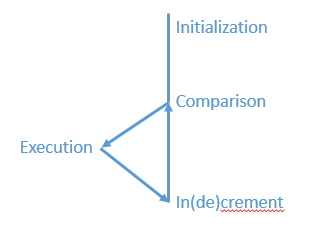
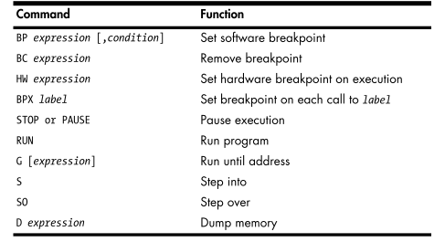
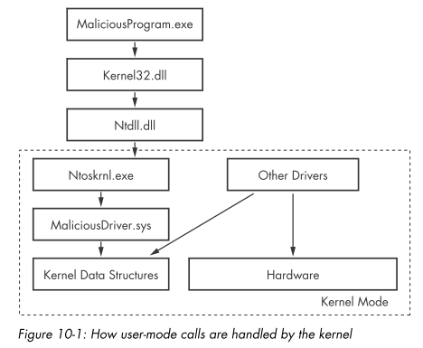
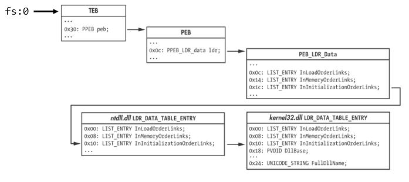

# Malware analysis学习笔记

## 一、基本静态分析

1. Antivirus scanning: http://www.virustotal.com
2. Hashing: 用哈希值对恶意软件进行识别，WinMD5
3. 寻找二进制文件中的字符串，strings
4. 检测二进制文件是否加壳，PEiD
5. 查看文件导入的链接库文件及函数
   1. static：很难分辨链接文件和源文件，不常见
   2. runtime：在恶意软件很常见，在需要该函数的时候才连接库文件
   3. dynamic：在程序开始时连接库文件，最常见。Dependency Walker
   4. 使用`LoadLibrary`、`GetProcAddress`等函数导入其他函数，**静态分析**时无法判断到底导入了哪些函数

> 函数命名规则：
>
> Ex: 以`Ex`结尾的函数为新函数，与旧函数功能不兼容，两者同时存在。如果更新了两次，后面就有两个`Ex`
>
> A：以`A`结尾的函数说明其参数为ASCII字符串，文档中函数名不包含`A`
>
> W：以`E`结尾的函数说明其参数为宽字符串，文档中函数名不包含`W`

6. 常见的导入函数

`SetWindowsHookEx`: 可能是keylogger

`CreateProcess`+`Sleep`：可能是backdoor

7. 常见注册表项

` Software\Microsoft\Windows\CurrentVersion\Run` 用于设置开机启动程序

8. PE文件中存在的信息

   1. sections:

   `.text`：代码，只有该section可以执行

   `.rdata`：全局只读数据

   ​	`idata`：导入函数信息

   ​	`edata`：导出函数信息

   `pdata`：64位程序，保存异常处理信息

   `data`：全局数据

   `rsrc`：各种资源，icon image menu string

   `reloc`：库文件重定位信息

   2. 查看头部信息：PEview

   `IMAGE_FILE_HEAD`

   ​	`Time Date Stamp`

   `IMAGE_OPTION_HEADER`	

   ​	`Subsystem`：`IMAGE_SUBSYSTEM_WINDOWS_CUI`控制台程序

   ​							`IMAGE_SUBSYSTEM_WINDOWS_GUI`GUI程序

   `IMAGE_SECTION_HEADER`

   ​	`Virtual Size`：加载时的大小

   ​	`Size of Raw Data`：在硬盘上的大小，大小与上一项相同，可能存在微小的不同

   ​	如果加载时的大小远大于硬盘上的大小，说明程序可能被打包了

   3. 查看`rsrc`信息：Resource Hacker

9. 流程：

virustotal扫描→strings查看字符串→PEview查看类型、编译时间及大小→PEiD查看是否打包→Dependency Walker查看导入导出函数→Resource Hacker查看资源

## 二、基本动态分析

1. sandbox软件：GFI等。这种方式有很多缺点，而且其功能通过下面的各个步骤也能够实现

2. DLL文件的执行

   1. 使用`rundll32.exe`直接执行DLL文件

      ```
      >rundll32.exe DLLname, Export arguments
      ```

   2. 把DLL文件改成EXE文件

      擦除`IMAGE_FILE_HEADER`中的`IMAGE_FILE_DLL(0x2000)`标志

   3. DLL需要注册服务

      ```
      C:\>rundll32 ipr32x.dll,InstallService ServiceName
      C:\>net start ServiceName
      ```

      如果DLL中不存在`InstallService`这样的输出函数，也可以手动注册服务，使用`sc`命令或者在注册表` HKLM\SYSTEM\CurrentControlSet\Services`中添加服务

3. 使用`procmon`监控软件的行为

   1. `File->Capture Events`停止监控行为

   2. `Edit->Clear Display`清空显示

   3. 开启监控，打开软件，等一段时间，停止监控

   4. 善用filter，过滤特定的进程名称、行为、详情

      `Operation` is`RegSetValue`、`WriteFile`

4. 使用`procexp`查看正在运行的进程

   1. `proexp`会显示在启动的进程为绿色，在结束的进程为红色。在恶意软件运行时，监控这些情况
   2. 还会显示导入的DLL以及具有的handle信息
   3. `properties`页面会提供线程、TCP/IP连接、字符串等信息，`Image`选项卡中的`Verify`功能可以验证硬盘上的该软件是不是真正微软签名的软件
   4. `Strings`选项卡中可以比较`Image`和`Memory`两者间的字符串是否相同，用以判断process replacement行为
   5. *Find Handle or DLL + Dependency Walker检查导入的DLL文件区别*

5. 恶意文档的检查

   打开监控软件，然后打开文档，查看是否有新进程的产生

   注意要使用旧版本的文档查看器

6. 使用`Regshot`检查恶意软件启动前后注册表的变化情况

7. 网络的伪造

   1. `apateDNS`将恶意软件的DNS请求响应到本地`127.0.0.1`，查看恶意软件发出的DNS请求
   2. 使用`netcat`监控本地的80、443端口，可以查看恶意软件接下来发出的请求
   3. `wireshark`

8. `INetSim`安装在另一个linux虚拟机中，处于同一网络，模仿网络服务，接收恶意软件发出的

9. 完整的安装配置：

> 1. Running procmon and setting a filter on the malware executable name 
> and clearing out all events just before running.
> 2. Starting Process Explorer.
> 3. Gathering a first snapshot of the registry using Regshot.
> 4. Setting up your virtual network to your liking using INetSim and 
>    ApateDNS.
> 5. Setting up network traffic logging using Wireshark.


## IDA PRO 使用指南

1. 可以使用`raw binary`的方式导入文件

   This option can prove useful because malware sometimes appends shellcode, additional data, encryption parameters, and even additional executables to legitimate PE files, and this extra data won’t be loaded into memory when the malware is run by Windows or loaded into IDA Pro.

2. graph模式下箭头的颜色：

   红色：不跳转；绿色：跳转；蓝色：无条件跳转

3. 使用` Windows->Save desktop`保存当前窗口排布设置

4. 不同的链接类型

   1. `sub_*`表示函数的开始：`printf`、`sub_4010A0`
   2. `loc_*`表示跳转目标：`loc_40107E`、`loc_401097`
   3. `offset`链接表示内存的偏移

5. 使用` Jump->Jump to File Offset`跳转到任意偏移位置

6. 选中函数名后再点击`x`可以查看所有该函数的交叉引用

7. 在数据在右键，选择` Use Standard Symbolic Constant option`，可以为其设置已命名的常量名（根据MSDN中的定义）。

   使用` View->Open Subviews->Type Libraries`导入其他库文件：`mssdk`和`vs6win`是自动导入的，例如恶意软件经常使用的`ntapi`(windows nt family api)或`gnuunx`(gnu c++ unix)

8. PEiD中的插件 Krypto ANALyzer 可以导出IDC脚本……

9. 一些快捷键

   1. 空格切换graph和text模式
   2. `g`键：可以跳转到指定地址
   3. `p`键：帮助识别函数
   4. `alt+p`键设置`BP based frame`，指定寄存器大小等函数信息
   5. `:`设置注释；`;`设置交叉引用的注释
   6. `o`：修改操作数为“内存引用”或者为“纯数据”
   7. `u`将错误识别的函数、代码或数据转换为纯字节数据，`c`将字节数据转换为代码，`d`转换为数据，`a`转换为ascii字符串
   8. `t`创建`struct`结构体

## 汇编语言中的C结构

1. 全局变量使用内存地址引用，本地变量使用栈地址引用。

2. `if`语句会使用条件转移，`else`结构之前会使用`jmp`指令，表示只有一条路径会执行。

   使用graph视图，可以有效提高识别C语言结构的速度。

3. 循环结构

   1. `for`循环

      

   2. `while`循环和`for`循环类似

4. 函数调用规范

   |                  | cdel     | stdcall         | fastcall                                     |
   | ---------------- | -------- | --------------- | -------------------------------------------- |
   | **参数压入顺序** | 从右至左 | 从右至左        | #1: ECX<br />#2: EDX<br />其他: 从右至左压入 |
   | **栈清理**       | 调用者   | 被调用者        | 调用者                                       |
   | **返回值**       | EAX      | EAX             | EAX                                          |
   | **其他**         |          | Windows API标准 | 各编译器实现情况不同<br />效率更高           |

5. `switch`语句

   1. `if` style

      很难区分源码中使用的是一连串`if`还是`switch`

   2. jump table

6. 链接表结构

   > To recognize a linked list, you must first recognize that some object contains a pointer that points to another object of the same type. 
   
```assembly
   004010CC        mov     eax, [ebp+var_4]
   004010CF        mov     eax, [eax+4]
   004010D2        mov     [ebp+var_4], eax
```

## Windows恶意软件

1. 匈牙利命名法

   在变量名之前使用额外的字符表示其类型。例如：

   | 类型         | 前缀 | 说明                             |
   | ------------ | ---- | -------------------------------- |
   | WORD         | w    | 16位无符号数                     |
   | DWORD        | dw   | 32位无符号数                     |
   | Handle       | h    | 对象的引用                       |
   | Long Pointer | lp   | 指针。也可能出现Pointer(p)的情况 |
   | Callback     |      | 会被Windows API调用的函数。      |

2. 常用文件处理函数

   `CreateFile`、`ReadFile`、`WriteFile`

   ⭐`CreateFileMapping`、`MapViewOfFile`：代替windows loader的功能

3. 特殊的文件

   1. 共享文件：`\\servername\share`、`\\?\servername\share`

   2. 设备：

      Win32 Device namespace: `\\.\PhsicalDisk1` 

      NT namespace: `\Device\PhysicalDisk1`、`\Device\PhsicalMemory`(kernel mode)

   3. Alternate Data Streams

      在NTFS文件系统中，一个文件(test.txt)在创建的时候，其真正的文件名其实是`test.txt::$DATA`，也就是说它有一个默认的数据流，该流没有名称。

      如果在`test.txt:Stream`中写入内容，就是在一个叫做`Stream`的数据流中写入内容，这部分内容不会在`test.txt`文件中显示出来。

      这一特性可以用来隐藏数据。

4. 注册表

   1. Root Keys: `HKEY_LOCAL_MACHINE(HKLM)`、`HKEY_CURRENT_USER(HKCU)`、`HKEY_CLASSES_ROOT`、`HKEY_CURRENT_CONFIG`、`HKEY_USERS`
   2. 一个很常见的键：`HKEY_LOCAL_MACHINE\SOFTWARE\Microsoft\CurrentVersion\Run`，设置自动启动
   3. 常见注册表函数：`RegOpenKeyEx`、`RegSetValueEx`、`RegGetValue`
   4. 也可以使用`.reg`文件修改注册表

5. 网络

   1. `ws2_32.dll`中实现了Berkeley Compatible Sockets的网络功能，包含`socket`、`bind`、`listen`、`accept`、`connect`、`recv`、`send`等函数
   2. 在调用所有网络函数之前，一定会先调用`WSAStartup`函数，所以可以找这个函数。
   3. `Wininet.dll`中实现了更高级的网络功能，例如HTTP和FTP协议，`InternetOpen`、`InternetOpenUrl`、`InternetReadFile`

6. 执行外部代码

   1. DLL文件
      - 把恶意代码放在DLL文件中，然后在其他进程中加载。
      - 使用windows dll
      - 使用第三方dll
   2. 进程
      - 经常使用`CreateProcess`创建一个远程shell，主要关注`lpCommandLine`、`lpProcessInformation`和`lpStartupInfo`参数
      - 会在resource section中存储另一个可执行文件，执行后将这个文件存到硬盘，并创建该进程
   3. 线程
      - 使用`CreateThread`加载新的恶意库，其中参数`lpStartAddress`是`LoadLibrary`的地址，参数`lpParameter`是库文件的名字
      - 创建两个线程，一个用于输入（从socket/pipe获取数据），一个用于输出（将数据从socket/pipe发送出去）
   4. 互斥锁(Mutexes)
      - 恶意软件经常会使用mutex，而且一般来说其名称都是硬编码的，所以是一个host-based indicator。
      - `OpenMutex`查看某互斥锁是否存在
        - 存在：获取该互斥锁handle
        - 不存在：`CreateMutex`
      - `WaitForSingleObject`获取互斥锁，`ReleaseMutex`释放互斥锁
   5. 服务
      - 高权限、持久化、不易发现
      - 使用类似Autoruns这样的工具查看正在运行的服务
      - 使用服务相关函数需要先调用`OpenSCManager`，其他函数：`CreateService`、`StartService`
      - 服务类型
        - `WIN32_SHARE_PROCESS`: 代码在DLL文件中。`svchost.exe`
        - `WIN32_OWN_PROCESS`: 代码在exe文件中
        - `KERNEL_DRIVER`
      - 服务的信息保存在`HKLM\SYSTEM\CurrentControlSet\Services`中，可以使用`sc`命令管理服务。
   6. Component Object Model(COM)
      - 先搜索软件是否使用了`OleInitialize`或者`CoInitializeEx`函数，确定是否使用了COM功能
      - `CoCreateInstance`会获取具体的某个`CLSID`,`IID`的功能，其中IID参数一般会识别出来，CLSID可以在` HKLM(HKCU)\SOFTWARE\Classes\CLSID\ `找到包含代码的具体DLL(`InprocServer32`)或者EXE(`LocalServer32`)。该IID支持的所有函数都包含在函数返回的结构体中，但某个具体函数的偏移位置需要IDA识别或查看文件。使用`INSERT`键在IDA中添加结构体信息`InterfaceNameVtbl`
      - 一个常用的功能`Navigate`，在`IWebBrowser2`接口中，一般IE会实现该接口。
      - 实现COM server的恶意软件很容易检测到，因为它们必须输出以下函数： `DllCanUnloadNow`, `DllGetClassObject`, `
        DllInstall`, `DllRegisterServer`和 `DllUnregisterServer`
   7. 异常
      - Structured Exception Handling存储在栈上的情况
      - `fs:0`位置指向栈上一个存储了异常处理信息的位置，异常发生时软件会查询该位置，获得异常处理函数的地址
      - 攻击者可以通过栈溢出覆盖该地址，执行任意代码

7. kernel mode& native API

   - 如果反汇编代码中出现了`SYSENTER`、`SYSCALL`、`INT 0x2E`，就说明要进入kernel mode了。
   - 下图左是正常调用win32 API时程序的执行路径，软件调用win32 API，该API可能包含在`Kernel32.dll`或其他DLL文件中，该DLL会进一步调用`Ntdll.dll`，该文件用于处理用户态和内核态的交互，处理器进入内核态，大多数内核函数都位于`Ntoskrnl.exe`中。
   - 下图右是软件调用native API时的情况，`Ntdll.dll`中包含的API就属于native API，软件不应该直接调用这些API。

   

   - 查询系统情况：`NtQuerySystemInformation, NtQueryInformationProcess, NtQueryInformationThread, NtQueryInformationFile, NtQueryInformationKey`
   - `NtContinue`，从异常处理返回，攻击者可以控制返回地址，改变执行流程
   - Native API的函数的前缀可能是`Nt`或者`Zw`，但是这里不影响分析。

### Lab07-03总结

#### 出现的问题

1. ida识别参数名的自动化，导致我没有明确commandline到底是什么
2. 没有注意到`sub_4011A0`函数最后一小段中比较`kernel32.dll`那部分代码🤯
3. 可以在procexp中查看正在运行的exe文件的import，发现`kernel132.dll`被导入了
4. 我只检查了`Lab07-03.dll`，并没有检查`kerne132.dll`，完全忘记这里不单纯进行了复制

#### 经验教训

1. 及时记录，包括分析结果和暂时没有结论的部分，方便后续再次查看

2. 遇到很复杂和麻烦的函数，虽然不需要逐指令分析，但是也要看一下`call`指令的调用情况，同时大致浏览每部分内容，不要有略过的部分。

3. `rep stosb` -> `memset`

   `repne scasb` -> `strlen`

   `rep movsd` -> `memcpy`

## 一些调试的基本概念

1. 内核调试：使用Windbg，需要两台机器，一台机器运行debugger，一台机器运行需要调试的程序
2. 在进行调试之前，可以打开VMware的record功能，如果stepping-over了一个重要函数，可以replay，然后重新stepping-into这个函数。
3. Software execution breakpoint: 一般调试器设置的都是这种断点，其实就是把设置断点位置的指令的第一个字节修改为`0xCC(INT 3)`。
4. Hardware execution breakpoint: 针对地址设置断点，比如当EIP的地址为某值时，暂停执行；当某地址被访问(读/写)，暂停执行。`DR0`~`DR3`寄存器存储断点地址，`DR7`存储控制信息。这些寄存器内容易被程序修改，`DR7`中的General Detect Flag用于检测通过`mov`指令访问这些寄存器的情况。
5. 在恶意软件分析过程中，first-chance exception通常是作者故意添加提高调试难度的，要关注second-chance exception，它表示软件会崩溃（可能是环境原因）。

## Ollydbg

1. 快捷键

   1. 汇编代码处按`space`可以进行修改
   2. 内存区域处按`ctrl+g`可以跳转到任意地址
   3. 选定指令后，按`F2`可以添加/删除断点

2. 由于rebase的原因，ida和ollydbg中的内存地址可能不一样，这时候可以使用ida的manual load功能

3. `Execute till user code`可以在迷失于库代码时使用。

4. `step over`的调试方式，如果之后的函数不执行`ret`或者直接把返回地址弹出栈了，调试就无法正常进行。

5. 调试DLL文件时，先将文件加载进ollydbg，点击运行，运行停止后，选择`Debug->Call DLL Export`。

6. 在调试恶意软件时，可以直接在`Debugging Options`中直接忽略所有exception。

7. 分析shellcode

   > 1. Copy shellcode from a hex editor to the clipboard.
   > 2. Within the memory map, select a memory region whose type is Priv. 
   > (This is private memory assigned to the process, as opposed to the read-
   > only executable images that are shared among multiple processes.)
   > 3. Double-click rows in the memory map to bring up a hex dump so you 
   > can examine the contents. This region should contain a few hundred 
   > bytes of contiguous zero bytes.
   > 4. Right-click the chosen region in the Memory Map window, and select 
   > Set Access->Full Access to give the region read, write, and execute 
   > permissions.
   > 5. Return to the memory dump window. Highlight a region of zero-filled 
   > bytes large enough for the entire shellcode to fit, right-click the selec-
   > tion, and select Binary->Binary Paste. This will paste the shellcode to the 
   > selected region.
   > 6. Set the EIP register to the location of the memory you modified. (You 
   > can easily set the EIP register by right-clicking an instruction in the dis-
   > assembler window and selecting New Origin Here.)

8. Command Line插件

   

### Lab09-01.exe总结

在完成该实验的过程中，我更多的使用了ida pro，一方面是出于习惯，一方面在于ida对于变量的识别，还是graph视图在静态分析汇编代码时都更方便。不过也反映出来我现在还不太习惯动态分析。

动态分析的节奏和静态分析有很大不同，要善于、勤于设置断点，及时查看关键步骤执行前后内存、寄存器、栈的变化情况。

### Lab09-02.exe总结

这个实验分析的比上一个要顺利，我独立的分析出了它的功能，但是还是有一些细节有所疏漏，需要注意的问题就是Windows API中一些结构体参数的设置，我大多数都直接忽略了，导致到后期才发现程序连接的是9999端口，STARTUPINFO结构体那里也没有仔细看，虽然最终也通过直接执行发现了它的后门功能，但是stdin、stdout、stderr那里传入socket也应该注意到。

除此之外还应该注意函数的传入参数情况，虽然此次实验中并不影响，但我在这里做的也不好。

### Lab09-03.exe总结

这个实验比较简单，虽然都做出来了，但是我犯了一个很大的错误，我忽略了dll文件中的main函数，疑惑了半天`temp.txt`这个文件名怎么传进去了😓原因还是在于我对DLL文件的不熟悉，总是忘记DLL文件与EXE文件的相似性。

还有就是查看DLL文件基址的方法：PEview->IMAGE_OPTIONAL_HEADER->Image Base。

注意在IDA中，如果有没有识别出来的结构体，可以自己INSERT

## Kernel Debugging

1. driver的作用


2. 驱动有一个DriverEntry，其中注册了所有callback function的地址。系统会创建一个driver object结构体，DriverEntry会向其中填入callback functions，然后创建一个可以从用户态访问的device，用户态程序就通过这个device与驱动交互，其发出的请求最终会调用这些callback function。用户态程序经常会调用`DeviceIOControl`函数

3. 恶意驱动处理来自用户态的请求

   

   > Malicious drivers generally do not usually control hardware; instead, 
   > they interact with the main Windows kernel components, **ntoskrnl.exe** and 
   > **hal.dll**. The ntoskrnl.exe component has the code for the core OS functions, 
   > and hal.dll has the code for interacting with the main hardware components. 
   > Malware will often import functions from one or both of these files in order 
   > to manipulate the kernel.

   ### windbg调试配置总结

   主机：64位win10，安装windbg

   虚拟机：32位winxp, win7

   1. 虚拟机：控制面板->系统->高级->启动和故障恢复 设置->系统启动 编辑->添加一行

      ```
      multi(0)disk(0)rdisk(0)partition(1)\WINDOWS="Microsoft Windows XP Professional with Kernel Debugging" /noexecute=optin /fastdetect /debug /debugport=com1 /baudrate=115200
      ```
      win7设置：

      以管理员身份打开命令行->

      ```
      bcdedit /dbgsettings serial baudrate:115200 debugport:1
      bcdedit /copy {current} /d DebugEnty       // 复制得到的ID号
      bcdedit /displayorder {current} {ID}
      bcdedit /debug {ID} ON
      ```

      

   2. VMware：VM->Setting->(确保在Hardware选项卡中已经删除了Printer)->🛡Add...->Serial Port->Next->

      ```
      Use named pipe: \\.\pipe\com_1
      This end is the server.
      The other end is an application.
      ```

      然后勾选`Yield CPU on poll`

      ->OK

   3. Windbg(x86): 

      在桌面->新建->快捷方式->

      ```
      Target "C:\Program Files (x86)\Windows Kits\10\Debuggers\x86\windbg.exe" -b -k com:port=\\.\pipe\com_1,baud=115200,pipe
      ```

      添加环境变量：

      - 修改Path: 添加Windbg的安装目录
      - 添加环境变量`_NT_SYMBOL_PATH`，值为`srv*c:\mss*http://msdl.microsoft.com/download/symbols`

   4. 启用虚拟机，选择调试模式，打开桌面windbg的快捷方式，windbg打开，这时应该处于中断模式，虚拟机是黑屏的，在windbg的下方`0: kd>`处输入`g`，回车，可以让虚拟机继续启动

3. windbg命令

   ```
   da/du/dd addressToRead					;打印
   ex addressToWrite dataToWrite			;写入
   du dwo (esp+4)							;dwo 取值
   bp GetProcAddress "da dwo (esp+8);g"	;执行到该函数时自动打印第二个参数，不再由用户处理
   lm										;列出导入的所有模块,exe,dll,kernel driver
   u nt!NtCreateProcess					;查看该函数的反汇编代码
   bu newModule!exportedFunction			;在该模块导入后立即在该函数上设置一个断点
   bu $iment(driverName)					;在该驱动的入口点设置一个断点
   x nt!*CreateProcess*					;使用通配符进行搜索
   ln 805717aa								;列出该地址附近的symbols
   dt nt!_DRIVER_OBJECT					;打印结构体(_DRIVER_OBJECT)信息
   dt nt!_DRIVER_OBJECT 828b2648			;打印结构体内具体的数值
   										;注意驱动的初始化函数，可能包含恶意代码
   !drvobj FileWriter						;查找driver object
   !object \Driver							;列出Driver命名空间的所有对象
   !devobj FileWriterDevice				;查找device object
   !devhandles 826eb030					;查找拥有该设备句柄的所有用户态程序
   !idt									;查看Interrupt Descriptor Table
   ```

4. _DRIVER_OBJECT中有一项MajorFunction保存的就是callback functions的地址信息，其中每个索引具体代表了哪类请求可以从`wdm.h`中找到，而且都以`IRP_MJ`开头

5. 恶意驱动分析流程：

   1. 恶意软件中调用`CreateFile`获取device object，根据参数获得该对象的名字

   2. `!devobj 【设备对象名字】`：获得其指向的driver object的地址和名字

      *或者*：windbg在恶意软件运行时输出了一个驱动的加载信息，由此获得driver object的名字

      再使用`!drvobj 【驱动对象名字】`获得其地址

   3. `dt nt!_DRIVER_OBJECT 【驱动对象地址】`：获得major function table的位置

      `!devhandles 【设备对象地址】`：获得所有拥有该设备句柄的用户态程序

   4. `dd 【驱动对象地址+0x38】 L1C`显示major function table中的信息

      `ln 【某具体函数地址】`查看感兴趣函数的函数名，从名字可以反应出函数的功能

6. 系统使用`SYSENTER`进行系统调用，`EAX`用来传入目标函数在System Service Descriptor Table中的索引值。Rootkit可以修改SSDT中`NtCreateFile(25h)`处的函数地址，让系统执行自己写的相似函数，从而让程序无法打开想要隐藏的文件。

7. SSDT存储位置可以通过`dd nt!KeServiceDescriptorTable`获得

8. 驱动可以使用`IoConnectInterrupt`注册一个中断码并指定Interrupt Service Routine(ISR)，所有的ISR信息都存储在Interrupt Descriptor Table中，如果其中出现了unnamed, unsigned, 或者其他可疑驱动，就说明可能有rootkit或者其他恶意软件。

### 第十章实验总结

1. 只完成了第三个实验，第一个实验是因为XP虚拟机的windbg安不上，第二个实验是因为运行后蓝屏，我这个版本的XP好像有保护措施。
2. 使用windbg的时候`!devojb ProcHelper`莫名其妙不能识别，后来再试了一次又好了，看输出好像是symbol那里有问题，我中间翻墙来着，也不知道是不是因为这个的原因😓
3. 不要嫌revert snapshot很麻烦，如果需要的话，直接执行一下恶意软件，看一下效果。
4. major function table 里面每一项都是针对固定请求会调用的函数，请求类别要查看`wdm.h`文件
5. 我分析到最后，驱动文件里面处理DeviceIOControl请求的函数时没有认真看，所以有一个很关键的原则，**不要根据代码的难易程度决定是否认真分析，而应该根据该函数的重要程度决定**。虽然还没仔细分析，但是我应该已经知道这个函数很关键了，所以不应该直接放过。
6. 可以分析的点：Windows API的参数、返回值，都有具体的文档参考，要注意观察。
7. Windows这一块的内容有太多陌生的地方了，所以要善用搜索引擎，看到不熟悉的概念、函数或者结构体就搜索一下，可能就能弄明白代码究竟在干什么了。

## Malware功能

1. Downloader: 从网上下载恶意软件并执行，常用函数`URLDownloadtoFileA`、`WinExec`

2. Launcher(loader): 一般自己本身包含想要加载的恶意软件

3. Backdoor: 

   1. Reverse Shell:
      - 创建socket，将cmd.exe的标准流连接到socket上(`STARTUPINFO`)，`CreateProcess`运行cmd.exe，设置隐藏窗口
      - 多线程：`CreatePipe`将读写连接到pipe上，`CreateProcess`把cmd.exe的标准流连接到pipe上，`CreateThread`创建两个线程，一个用于从stdin pipe读取数据并发送给socket，一个用于从socket读取数据并发送给stdout pipe。该方法可以在线程中对数据进行编码和解码
   2. RAT(remote administration tool)：在受害者机器上安装服务器组件，攻击者作为客户端可以随时进行连接并执行任意操作。
   3. Bonet: 僵尸网络，大量受感染主机的集合。攻击者可以同时操控这些机器散播病毒或执行DDoS攻击。

4. Credential Stealer:

   1. 在登录时记录凭证

      GINA Interception: winlogon.exe -> 【第三方DLL】-> msgina.dll

      第三方DLL记录在`HKLM\SOFTWARE\Microsoft\WindowsNT\CurrentVersion\Winlogon\GinaDLL`，通常会输出很多前缀为`Wlx`的函数

   2. 转储系统上保存的凭证：LM/NTLM哈希值，变种的Pwdump, Pass-the-Hash Toolkit

      - 都是向`lsass.exe`中进行DLL注入，但是使用不同的API函数
      - 要查看DLL文件的export函数，以及其中调用的API，应该会有很多`GetProcAddress`调用
      - Pwdump: samsrv.dll, advapi32.dll, SamIConnect, SamrQueryInformationUser, SamIGetPrivateData, SystemFunction025, SystemFucntion027
      - PSH Toolkit: whosthere-alt, secur32.dll, LsaEnumerateLogonSessions, msv1_0.dll, NlpGetPrimaryCredential
      - 在分析程序是怎样转储凭证之前，应该先弄清楚程序怎样处理这些凭证。

   3. 记录键盘活动

      1. Kernel-Based Keyloggers: 直接伪装成键盘驱动，很难检测
      2. User-Space: 
         - Hooking: 检测键盘是否被按下`SetWindowsHookEx`，EXE文件初始化hook函数，DLL文件注入 系统的其他进程，用于记录
         - Polling: 不断查询键盘状态，`GetAsyncKeyState`, `GetForegroundWindow`

5. 持久化

   1. 修改注册表
      - `HKEY_LOCAL_MACHINE\SOFTWARE\Microsoft\Windows\CurrentVersion\Run`
      - `HKEY_LOCAL_MACHINE\SOFTWARE\Microsoft\Windows NT\CurrentVersion\Windows`值`AppInit_DLLs`，任何会加载`User32.dll`的程序都会加载该值中保存的DLL文件。使用了该方法的恶意DLL一般会在其`DllMain`中先检查其运行在哪个进程中。
      - （已不支持）`HKEY_LOCAL_MACHINE\SOFTWARE\Microsoft\Windows NT\CurrentVersion\Winlogon\`键`Notify`，在`winlogon.exe`产生事件时，系统会检查该键值，处理其中的DLL
      - 恶意DLL可以伪装成`svchost.exe`，该程序实例是一组服务的集合，不同的组在`HKEY_LOCAL_MACHINE\SOFTWARE\Microsoft\Windows NT\CurrentVersion\Svchost`中定义，服务在`HKEY_LOCAL_MACHINE\System\CurrentControlSet\Services\ServiceName`中定义，该键中的值`ImagePath`为`%SystemRoot%/System32/svchost.exe –k GroupName`，值`Start`一般为开机自启，且包含一个子健`Parameters`，值`ServiceDLL`就是恶意DLL的路径。
   2. 修改系统二进制文件：修改DLL文件的入口函数，直接跳转到恶意代码，恶意代码被放在一块空段中，会加载恶意软件，然后再返回到正常的DLL代码中。
   3. DLL load-order hijacking：不在`/windows/system32/`文件夹下的二进制文件在加载DLL文件时，会先搜索自己所在的文件夹，若1）需要的DLL文件不在当前文件夹；2）修改恶意DLL的文件名为需要的DLL，那么二进制文件就会直接加载恶意DLL。

6. 权限提升

   `OpenProcessToken`、`LookupPrivilegeValueA`、`AdjustTokenPrivileges`看到这些函数之后进行标记，不需要仔细分析

7. 用户态rootkits

   1. 修改Import Address Table或者Export Address Table中的函数指针指向rootkit
   2. 修改导入DLL文件的入口函数，改成跳转或者直接进行修改或破坏

### 11章实验总结

1. GINA方式记录登录凭证的DLL文件，还要检查其中的wlx_*函数
2. 代码分析流程问题，先是普通的静态分析，然后打开procmon运行一下，再在IDA中打开进行静态分析，如果静态分析中发现某个函数不太好分析，像是编码/解码，就打开ollydbg，定位该函数，查看执行结果
3. 恶意软件在修改内存或者进行Inline hook的时候，通常会调用`SuspendThread`和`ResumeThread`函数
4. 如果某个函数只在一个地方调用了，为了方便分析，可以对其参数进行命名处理
5. 恶意软件通过修改系统文件实现shellcode的调用，可以直接比较修改后的系统文件与原文件的区别，同时调试观察修改后的系统文件，不用直接检查shellcode。

## Malware的各种载入方式

1. Launchers大多需要在系统权限下运行，所以其内部很可能存在权限提升类API调用

### DLL注入

```
# 查找被注入进程
CreateToolhelp32Snapshot, Process32First, Process32Next
# 打开进程
hVictimProcess = OpenProcess(PROCESS_ALL_ACCESS, 0, victimProcessID);
# 为恶意DLL文件名分配空间
pNameInVictimProcess = VirtualAllocEx(hVictimProcess,...,sizeof(maliciousLibraryName),...,...);
# 设置恶意DLL文件名
WriteProcessMemory(hVictimProcess,...,maliciousLibraryName, sizeof(maliciousLibraryName),...);
# 找到LoadLibrary API的地址
GetModuleHandle("Kernel32.dll");
GetProcAddress(...,"LoadLibraryA");
# 创建线程载入恶意DLL
CreateRemoteThread(hVictimProcess,...,...,LoadLibraryAddress,pNameInVictimProcess,...,...);
```

**关键：**

- 被注入进程名：在第一步*查找被注入进程名*的过程中，`strncmp`可能会被调用，包含进程名
- 恶意DLL文件名：在*设置恶意DLL文件名*阶段，包含文件名

### 直接注入(Direct Injection)

和DLL注入类似，只不过会把恶意代码也注入到目标进程中，不再单独写在DLL文件内，一般注入的是shellcode。

`VirtualAllocEx`和` WriteProcessMemory`会被调用两次，第一次为恶意代码需要的数据分配空间；第二次为恶意代码分配空间

**关键**：在调用`WriteProcessMemory`之前，查看内存数据，里面包含了恶意代码(shellcode)，进行分析。

### 进程替换(Process Replacement)

```
# 以睡眠的状态创建被替换进程
CreateProcess(...,"svchost.exe",...,CREATE_SUSPEND,...);
# 释放该进程的内存
ZwUnmapViewOfSection(...);
# 为恶意代码分配空间
VirtualAllocEx(...,ImageBase,SizeOfImage,...);
# 写入恶意代码的头部
WriteProcessMemory(...,headers,...);
# 写入恶意代码的各个section
for (i=0; i < NumberOfSections; i++) {
	WriteProcessMemory(...,section,...);
}
# 设置被替换进程的entry point为新分配空间
SetThreadContext();
...
# 恢复线程启动
ResumeThread();
```

替换成`svchost.exe`是一个很流行的手法

### Hook Injection


1. 载入恶意DLL`LoadLibraryA`

2. 获得hook procedure地址`GetProcAddress`

3. 找到目标线程ID

4. `SetWindowsHookExA`

   hook procedure类型，一般选不常见的，比如`WH_CBT`

5. 向目标线程发送一个`WH_CBT`消息，恶意DLL载入了目标进程空间中，执行DLLMain

6. 一般DLLMain中会立即调用`UnhookWindowsHookEx`，不再继续拦截消息。

### Detour

【占位】

### APC Injection

1. from User Space

   和DLL注入的过程类似，只是最后不是创建一个新进程，而是通过` Thread32First 
   `和`Thread32Next`找到一个已存在的线程，`OpenThread`打开，`QueueUserAPC`注入APC。

   也可以通过` Nt/ZwQuerySystemInformation`，使用`SYSTEM_PROCESS_INFORMATION`搜索目标进程

2. from Kernel Space

   `KeInitializeApc`:第六个参数`NormalRoutine`不为0，第七个参数`ApcMode`为1，表示想要在user mode执行代码。第二个参数是要被注入的线程名。

   `KeInsertQueueApc`

## 数据编码

### 寻找编码信息

1. 从恶意软件中发现与编码算法相关的字符串

2. 查找代码中的`xor`指令

3. 在导入函数中发现与加密算法有关的API函数

4. 使用专门的工具发现相关的常量：FindCrypt2(ida)、Krypto ANAlyzer(PEiD)

   International DataEncryption Algorithm(IDEA)和**RC4**不会被识别

5. 在软件中搜索熵值高的内容，可能是密文

   1. 工具：IDA插件IDA Entropy Plugin
   2. 需要注意的是chunk size和entropy score。64，5.95；256，7.9

6. 直接追踪代码的运行，在输入之后、输出之前可能存在涉及解码、编码的代码

### 解码

1. 利用软件内部存在的解码函数

   查看运行时内存中存在的字符串和`strings`的输出有没有不同

2. 编码过程很简单，或者存在已有标准，可以自己编写解码脚本

3. 编写python脚本，在debugger中修改控制恶意软件的执行流程

### 13章实验总结

前两个实验都还好，主要是第三个实验：

1. 发现代码那么多之后心里可能产生了一些畏难情绪
2. 查找加密常量的时候技巧使用不足，有一个ida的插件也没有用，在和包含`xor`的函数对应的时候，出现了一些错误，导致整个流程的理解都出现了问题
3. **最关键：**对于AES的理解不足，key initialization的部分(s_xor1)我无法识别出来
4. 基于以上原因，我的分析就没办法正确进行下去了
5. 我的分析习惯也有一些问题，我习惯并下意识从起始点(main)出发，根据程序的执行进行分析，这样是有问题的。在作者的解答中，先明确了自己的已知信息，然后从已知信息的函数向外扩展，查看其调用与被调用情况、传递的参数、附近有没有标志性操作，同时查找已知信息函数之间的关系。
6. 最重要的就是，一定要有耐心。
7. 这个恶意程序使用了pipe连接cmd的输入输出，然后再连接对应的加密、解码算法，我看完答案之后自己对这部分代码进行了分析，花费了很长时间，因为我对pipe的理解存在一些问题。Again，耐心！

## Network Indicator

1. IP地址、domain

   怎样在不被恶意软件作者察觉的情况下进行分析？

   ​	使用可以隐藏身份信息的方法，tor, proxy, SSH, VPN, 云服务等，不会泄露自己的身份，但是会被作者察觉有人在隐藏身份。

   ​	使用搜索引擎，可能会触发对目标地址的访问。

   ​	使用网上存在的一些WHOIS服务

   whois信息

2. content

   发送数据包的时候有什么特别的标志，user-agent...

   多执行几次，看内容是否随机

   在多个主机上执行，看内容是否受到主机的影响

3. 深度分析

   1. 攻击者将信息隐藏在正常的网络流量中。User-Agent字段，URI参数……

      恶意软件接收的流量包中，恶意信息隐藏在正常内容中

   2. 动态分析，查找恶意软件运行后发出的流量包中**包含哪些可疑信息/缺少哪些必要信息**。多次执行，查看变化情况。

   3. 静态分析

      - 发送数据包：找到涉及网络部分的代码，分析可疑信息是怎样生成的
        - 使用的函数：`Winsock`、`WinINet`、`COM`
        - 数据来源：随机数、API libraray、硬编码信息、主机信息、从其他源接收的信息

        将硬编码信息、缺少的必要信息、变化的可疑信息特征（正则表达式）结合在一起，构成一个完整的signature

      - 接收数据包：
        - 对比恶意软件与接受的数据包之间有没有相似的字符串
        - 查看恶意软件代码中负责处理接收数据包的函数，构建有效的signature

   4. 可以将一个signature分成多个，针对恶意代码中的不同部分。这样如果攻击者修改某部分代码，并不会影响其他的signature


## Anti-Disassembly

原理是要利用反汇编器的选择和假设：

​	Linear Disassembly只能顺序进行反汇编，无法区分数据和代码

​	Flow-Oriented Disassembly在遇到有条件跳转指令时，会默认先反汇编false路径的代码，遇到`call`指令时，也会先反汇编`call`后面的代码。

所以要实现**一个反汇编器无法识别的流程跳转**

### 相关技术

1. 将无条件跳转伪装成有条件跳转，这样其中的一个分支本来不会作为代码执行，但是IDA会把这部分内容作为代码分析。

   **`jz`和`jnz`组合形成无条件跳转**  或  **让有条件跳转的条件永远为真**

   - 不会作为代码执行的部分是**多字节操作码的第一个字节**作为数据，这时IDA会把该数据字节识别成多字节操作码的一部分。此时跳转目标处于多字节操作码的中间。

   ```assembly
   74 03                  jz      short near ptr loc_4011C4+1
   75 01                  jnz     short near ptr loc_4011C4+1
   loc_4011C4:                     ; CODE XREF: sub_4011C0
                                                          ; sub_4011C0+2j
   E8 58 C3 90 90        call    near ptr 90D0D521h
   
   33 C0                  xor     eax, eax
   74 01                  jz      short near ptr loc_4011C4+1
   loc_4011C4:                             ; CODE XREF: 004011C2j
   ; DATA XREF: .rdata:004020ACo
   E9 58 C3 68 94         jmp     near ptr 94A8D521h
   ```

   - 不会作为代码执行的部分是一个**栈帧操作指令**，这时IDA会错误的对函数栈帧进行分析。（这时也可以使用**让有条件跳转的条件永远为假**的形式）

     ```assembly
     00401543     sub_401543      proc near           ; CODE XREF: sub_4012D0+3Cp
     00401543                                         ; sub_401328+9Bp
     00401543
     00401543     arg_F4          = dword ptr  0F8h
     00401543     arg_F8          = dword ptr  0FCh
     00401543
     00401543 000                 sub     esp, 8
     00401546 008                 sub     esp, 4
     00401549 00C                 cmp     esp, 1000h
     0040154F 00C                 jl      short loc_401556
     00401551 00C                 add     esp, 4
     00401554 008                 jmp     short loc_40155C
     00401556     ; --------------------------------------------------------------
     00401556
     00401556     loc_401556:                        ; CODE XREF: sub_401543+Cj
     00401556 00C                 add     esp, 104h
     0040155C
     0040155C     loc_40155C:                        ; CODE XREF: sub_401543+11j
     0040155C -F8                 mov     [esp-0F8h+arg_F8], 1E61h
     00401564 -F8                 lea     eax, [esp-0F8h+arg_F8]
     00401568 -F8                 mov     [esp-0F8h+arg_F4], eax
     ```

     

2. 让某个字节同时属于多个操作码

   

3. 使用函数指针，加大代码复杂度，让IDA无法识别函数的cross-references

4. 使用`retn`进行跳转操作。`retn`实际上执行的是`pop`+`jmp`，所以只要在之前修改了栈顶元素，再执行`retn`，就会进行跳转，而且IDA无法将之后的内容识别成正常函数。

   ```assembly
   004011C0 sub_4011C0      proc near               ; CODE XREF: _main+19p
   004011C0                                         ; sub_401040+8Bp
   004011C0
   004011C0 var_4           = byte ptr -4
   004011C0
   004011C0                 call    $+5
   004011C5                 add     [esp+4+var_4], 5
   004011C9                 retn
   004011C9 sub_4011C0      endp ; sp-analysis failed
   004011CA ; ------------------------------------------------------------
   004011CA                 push    ebp
   004011CB                 mov     ebp, esp
   004011CD                 mov     eax, [ebp+8]
   004011D0                 imul    eax, 2Ah
   004011D3                 mov     esp, ebp
   004011D5                 pop     ebp
   004011D6                 retn
   ```

5. 利用SEH，自己在SEH handler中添加一项，然后引发异常，隐蔽地进行跳转，而此时IDA认为异常后面的代码仍能正常执行。

   ```assembly
   ;手动添加exception handler
   push ExceptionHandler
   push fs:[0]
   mov fs:[0], esp
   ;引发异常
   xor ecx, ecx
   div ecx
   ;恢复现场
   mov esp, [esp+8]
   mov eax, fs:[0]
   mov eax, [eax]
   mov eax, [eax]
   mov fs:[0], eax
   add esp, 8
   ```

### 判断&处理

1. 使用ida时要显示操作码
2. ida中的cross-references显示为红色，说明引用的位置在当前指令的中间，而不是起始点
3. 使用快捷键C/D进行数据和代码之间的转换
4. 分析代码真正意图，将不必要的指令修改为NOP。IDC script `PatchByte(地址，字节值)`
5. 手动添加函数的cross-references。IDC script `AddCodeXref(引用地址，被引用地址，引用类型)`，引用类型：`fl_CF(call)`、`fl_JF(jump)`
6. 如果ida没有正确识别部分函数内容，在函数内按`alt+p`调整函数的边界；如果ida识别的函数栈帧有问题，使用`alt+k`快捷键调整栈指针

## Anti-Debugging

### 检测debugger的存在

1. Windows API: `IsDebuggerPresent`、`CheckRemoteDebuggerPresent`、`NtQueryInformationProcess`、`OutputDebugString`

   最后一个API原理：`SetLastError`设置一个特殊的错误码，调用一个只有debugger存在才会成功的函数，`GetLastError`输出的错误码如果发生改变，就说明不存在debugger

2. 手动检查PEB结构，实现API的功能。

   进程开始运行后，`fs:[30h]`保存了其PEB结构地址
   
   - PEB结构中，**第三个字节**为`BeingDebugged`标志。
   - `0x18`是`ProcessHeap`，指向进程的堆结构，包含了一个头部。头部偏移`0x10(xp)`、`0x44(7 32bits)`为`ForceFlags`标志，偏移`0x0c(xp)`、`0x40(7)`为`Flags`标志。
   - PEB结构中，偏移`0x68`表示进程如何创建堆结构，若为`0x70`，则表示在使用调试器。
   
3. 检查系统痕迹

   1. 注册表`HKEY_LOCAL_MACHINE\SOFTWARE\Microsoft\Windows NT\CurrentVersion\AeDebug`
   2. 查找文件系统，进程列表，打开窗口

4. 绕过手段：

   修改对应的标志位、修改运行流程、使用相关插件

### 识别debugger的行为

debugger在调试的时候会设置断点、单步调试，该行为会修改进程的代码。

1. 扫描代码中是否出现了`INT 3(0xCC)`指令或者`INT immediate(0xCD value)`指令。

2. 计算代码中每段的校验和是否有变化。

3. 检查执行时间：比较一段指令或者一个异常发生前后的时间差

   常见命令/函数：

   - `rdtsc(0x0F31)`计算机器自重启以来经过的时间
   - `QueryPerformanceCounter`、`GetTickCount`

4. 绕过手段：

   在检测timestamp之后再开始进行单步调试或设置断点、修改运行流程

### 干扰debugger的正常功能

1. 有些debugger在载入进程后会停止在entry point，但进程在执行到这里之前就已经执行过TLS callback，对TLS中的变量进行处理。恶意代码可以放在TLS callback中。

   **绕过手段：1)检查程序是否存在.tls段，在ida中按`ctrl+e`选择该段进行分析；2)设置ollydbg`Options->Debugging Options->Events->System breakpoint` windbg默认是在这里暂停**

2. debugger默认会在进程出现异常时对其进行捕获，恶意软件会在其代码中故意插入中断，模仿debugger的断点或者单步调试功能。

   **注意：**在进行恶意代码分析时，一般会把调试器设置成忽略异常，直接交由进程处理。

   - 插入`0xCD03(INT 3)`，WinDbg会捕捉这个异常，在后台为EIP增加一字节，导致执行完全不同的代码。

   - 插入`INT 3(OxCC)`:

     ```assembly
     push offset continue
     push dword fs:[0] 
     mov fs:[0], esp 
     int 3
     //being debugged
     continue: 
     //not being debugged 
     ```

   - 插入`icedp(0xF1)`，会生成单步调试异常，如果这时debugger在单步调试，会认为这是一个正常指令，不会执行异常处理函数。

### 利用Ollydbg1.1的漏洞

1. 错误信息：`Bad or Unknown 32-bit Executable File`

   原理：在PE头的`IMAGE_OPTIONAL_HEADER`结构中，将`NumberOfRvaAndSizes`修改成了一个大于`0x10`的数值。

   绕过：使用windbg或ollydbg2.0；直接修改对应数值为`0x10`

2. 错误信息：`File contains too much data`

   原理：在PE头的`IMAGE_SECTION_HEADER`结构中，将`SizeOfRawData`修改成一个特别大的数值

   绕过：使用windbg或ollydbg2.0；直接修改对应数值，该数值应接近`VirtualSize`，且为`IMAGE_OPTIONAL_HEADER`中`FileAlignment`的倍数。

3. 恶意软件中调用了`OutputDebugString("%s%s%s")`，导致ollydbg1.1崩溃。

### 绕过手段详解

1. 在Ollydbg中修改PEB中的标志

   - `Plugins->Command Line`->`dump fs:[30]+2`->在dump窗口中，右键`BeingDebugged`标志，选择`Binary->Fill With 00's`。修改其他标志也类似。

     ```assembly
     dump ds:[fs:[30] + 0x18] + 0x10         ; ForceFlags
     dump fs:[30] + 0x68                     ; NTGlobalFlag
     ```

   - 使用插件 PhantOm 中的`hide from PEB`选项

## Anti-Virtual Machine(VMware)

1. 初级检测手段：

   - 在进程列表、服务列表、注册表中搜索`VMware`字符串。

     `net start | findstr VMware`

     ` SYSTEM\CurrentControlSet\Control\DeviceClasses`

   - 查看MAC地址是否以固定数值开头，例如`00:0c:29`。查询函数`GetAdaptersInfo`

   - 查看硬件的版本

2. 绕过方法

   - 卸载VMware Tools或者停止该服务`net stop "VMware Tools Service"`
   - 在IDA中阻止恶意代码的检测流程。找到相关字符串的引用位置，修复。
     - 在调试过程中让相关的跳转指令无法实现
     - 使用十六进制编辑器修改比较的字符串`VMware`
     - 卸载软件/停止服务

3. 高级检测手段

   - 使用`sidt`指令检查IDTR寄存器(6字节)的第六个字节(内存基地址)是否是虚拟机使用的`0xFF`。

     ```assembly
     sidt    fword ptr [eax]
     mov     al, [eax+5]
     cmp     al, 0FFh
     jnz     short loc_401E19
     ```

     **绕过：**使用多核处理器，用NOP指令替换这部分指令

   - 使用`sldt`指令检查LDTR寄存器中的内容是否为零，不为零说明使用的虚拟机。

     **绕过：**`VM->Settings->Processors->Disable Acceleration`

     **绕过后检测：**使用`smsw`指令检查返回值的高位比特

   - 使用`in`指令检测I/O接口`'VX'`

     ```assembly
     004014FE        mov     eax, 'VMXh' 		; magic number
     00401503        mov     ebx, [ebp+var_1C]	; return information
     00401506        mov     ecx, 0xA			; operation"get VMware version type"
     											; 0x14: get the memory size
     00401509        mov     dx, 'VX' 
     0040150E        in      eax, dx
     ...
     00401541        cmp     ebx, 'VMXh' 
     00401546        jnz     short loc_40155C
     ```

     **绕过：**NOP-out `in`指令，修改跳转指令

   - 使用`str`指令检查task register(TR)寄存器中保存的segment selector，它指向了当前任务的task state segment(TSS)，在虚拟机和正常主机上该指令返回的数值不同。该方法在多处理器上不起作用。

   - 使用工具：ScoopyNG进行检测，原理和上述相同

   - 利用虚拟机的漏洞进行逃逸

4. 总结常用检测指令：`sidt`、`sgdt`、`sldt`、`smsw`、`str`、`in`、`cpuid`

### 实验总结

要明确自己想要找什么内容，从已知内容（例如字符串）出发，向外扩散，定位一个函数之后，查看它的cross-references，参数、返回值，不要单纯的从main函数出发按照执行流程进行分析

## Packers and Unpacking

### unpacker工作原理


①Loader/Stub根据Header为section分配空间，Stub将各section脱壳并放入对应空间

② 

- Stub会导入`LoadLibrary`和`GetProcAddress`函数，在①后，再根据原始的Imort信息，利用这两个函数将DLL文件导入，获得相应函数地址。
- 保持原始的Import table不变，由Windows loader负责处理导入。
- 只保留原始Import table中每个DLL文件中的一个函数，由loder负责导入DLL文件，stub负责恢复函数地址。
- 不保留任何Import内容，由stub自己从其他库中找到需要的函数，或者stub先找到上述两个函数，再用其定位其他函数。

③使用`jmp`、`call`、`ret`、`NtContinue`、`ZwContinue`将执行转到OEP。

### 识别程序是否加壳

1. 基础静态分析：

   导入表的内容过少，比如只包含`LoadLibrary`和`GetProcAddress`

   section的`Size of Raw Data`和`Virtual Size`相差过大

   section的名字泄露了packer信息

2. 导入IDA后看到的代码很少

3. 导入Ollydbg后提示可能加壳

4. 使用专门的工具计算熵值，例如` Mandiant Red Curtain`

### 手动脱壳

**静态脱壳：**分析packer的算法，写一个逆向的程序进行脱壳。

**动态脱壳：**运行程序，让stub完成可执行文件的加载，然后将内存中的进程保存到文件，重建Import table，修改PE header

1. 利用Ollydbg中的插件OllyDump

   ①`Plugins->OllyDump->Find OEP by Section Hop`会自动找到OEP的位置，设置断点

   ②`Plugins->OllyDump->Dump Debugged Process`会自动完成Import table的重建以及PE header的修改

   若OllyDump在上述步骤均失败，只将内存中的进程保存到文件，就需要自己完成接下来的步骤：

2. 重建Import table

   - 使用工具`ImpRec`: 选择可执行文件->输入OEP的RVA(相对虚拟地址)->IAT autosearch->GetImports->Fix Dump->选择OllyDump保存的文件
   - 将dump下来的文件在IDA中打开，每遇到一个调用地址超过程序范围的`call`指令就记录下来，然后在ollydbg中定位该地址，查看其功能并标记到ida中。
   - 根据PE文件的格式，找到import函数的位置，逐个查看并创建import table。

3. 寻找OEP

   OllyDump的自动寻找方法会监测执行从一个section转向另一个section的行为，有`trace-into`和`trace-over`两个选项：`trace-over`会掠过`call`指令，可能会忽略`call`指令不返回的情况；`trace-into`则可能出现false positive

   **直接定位：**

   - IDA：寻找以下特征的`jmp`指令
   
     位于代码最后（后面接了很多DB），会跳转到一个很远的地址（在graph视图下，该指令因为找不到目标而标红）。可以在ollydbg验证该目标地址的内容是否会在可执行文件载入后发生改变
   
   - 在栈上设置读断点
   
     确定stub第一次push时的栈地址，在该处设置一个hardware breakpoint on read。应尝试多种类型的断点。
     
   - 在已知原始程序一定会调用的函数上设置断点，向上回溯
   
     命令行程序：`GetVersion`、`GetCommandLineA`
   
     GUI程序：`GetModuleHandleA`
   
   - 使用ollydbg的`Run Trace`选项，在`.text`第一次有指令执行的时候中断。
   
   **加快寻找速度**
   
   - 在调用`GetProcAddress`的地方设置断点，这样可以跳过大部分stub的代码
   - 在每次循环结束的地方设置断点，可以跳过很多重复的部分
   
   **验证**
   
   - 跳转到OEP的偏移量会偏大，通常stub并不大
   - OEP附近的代码看起来比stub的代码更加正常

### 常见的packer

| packer         | OEP                                                          | Import table               | anti-debugging              |
| -------------- | ------------------------------------------------------------ | -------------------------- | --------------------------- |
| UPX            | OllyDump, Stub终点的tail jump                                | OllyDump                   | -                           |
| PECompact      | 终点的tail jump `jmp eax`                                    | -                          | 调试时要绕过异常            |
| ASPack         | 自动化工具，在栈上设置硬件读断点`PUSHAD`                     | 自动化工具                 | -                           |
| Petite         | 在栈上设置硬件读断点                                         | 为每个库保留了一个导入函数 | 将single-step异常传递给程序 |
| WinUpack/UPack | 自动化工具;<br/>在`GetProcAddress`上设置断点，在之后的每个jmp和call上设置断点，找到`ret`；<br>在`GetModuleHandleA`或`GetCommandLineA`上设置断点 | 自动化工具                 | 利用了ollydbg的漏洞         |
| Themida        | 自动化工具；使用`ProcDump`直接将正在运行的进程dump下来进行一些基本的分析 | 自动化工具                 | 阻止调试、虚拟机、procmon   |

### DLL文件脱壳

先用编辑器把`IMAGE_FILE_HEADER`中`0x2000`位置处的`1`修改为`0`，变成EXE文件，然后执行上述的脱壳技巧找到OEP，再把该位改回去

## Shellcode

shellcode是position independent code，所有的地址计算应该都是**基地址+偏移**的方式，`jump`和`call`这类跳转指令可以直接使用这种方式，但是`mov`这类指令必须首先把eip中的地址传入通用寄存器中，作为基地址。

### 获得基地址的方式

1. `call`+`pop`

   `call`指令实际做的是`push eip` + `jump 【address】`的操作，在`【address】`开始的地方执行`pop 【寄存器】`就可以把eip的内容保存到【寄存器】中。

2. `fnstenv`

   系统执行浮点运算时，会更新FPU的执行环境，`fnstenv`指令会将该环境保存到内存中，保存的结构为

   ```c++
   struct FpuSaveState {
       uint32_t    control_word;
       uint32_t    status_word;
       uint32_t    tag_word;
       uint32_t    fpu_instruction_pointer;
       uint16_t    fpu_instruction_selector;
       uint16_t    fpu_opcode;
       uint32_t    fpu_operand_pointer;
       uint16_t    fpu_operand_selector;
       uint16_t    reserved;
   };
   ```

   偏移12处的`fpu_instruction_pointer`就是执行浮点运算的指令地址。可以以此为基地址进行地址计算。

   ```assembly
   Bytes            Disassembly
   83 EC 20         sub     esp, 20h
   31 D2            xor     edx, edx
   EB 15            jmp     short loc_1C
   EA 07 45 7E      dd 7E4507EAh               ; MessageBoxA
   FA CA 81 7C      dd 7C81CAFAh               ; ExitProcess
   48 65 6C 6C 6F   db 'Hello World!',0
   20 57 6F 72 6C 
   64 21 00            
   loc_1C:
   D9 EE            fldz 
   D9 74 24 F4      fnstenv byte ptr [esp-0Ch] 
   5B               pop     ebx          ; ebx points to fldz 
   8D 7B F3         lea     edi, [ebx-0Dh]     ; load HelloWorld pointer
   52               push    edx                ; uType: MB_OK 
   57               push    edi                ; lpCaption
   57               push    edi                ; lpText
   52               push    edx                ; hWnd: NULL
   8B 43 EB         mov     eax, [ebx-15h]     ; load MessageBoxA
   FF D0            call    eax                ; call MessageBoxA
   52               push    edx                ; uExitCode
   8B 43 EF         mov     eax, [ebx-11h]     ; load ExitProcess
   FF D0            call    eax                ; call ExitProcess
   ```


shellcode需要自己处理导入的库文件及函数，通常会使用`kernel32.dll`中的`LoadLibraryA`和`GetProcAddress`函数获得其他需要函数的地址。

### API地址解析流程

1. 确定`kernel32.dll`的位置

   

   ```assembly
   findKernel32Base:
   mov     eax, [fs:eax+0x30]	 ; eax gets pointer to PEB
   mov     eax, [eax + 0x0c]	 ; eax gets pointer to PEB_LDR_DATA
   ;esi gets pointer to 1st
   ;LDR_DATA_TABLE_ENTRY.InInitializationOrderLinks.Flink
   mov     esi, [eax + 0x1c]	 
   ;eax gets pointer to 2nd
   ;LDR_DATA_TABLE_ENTRY.InInitializationOrderLinks.Flink
   lodsd 
   mov     eax, [eax + 8]       ; eax gets LDR_DATA_TABLE_ENTRY.DllBase
   ```

   win7之前，第二个初始化的DLL是kernel32.dll，从win7开始就不是了，所以需要对`InInitializationOrderLinks`进行遍历，查看`LDR_DATA_TABLE_ENTRY`中偏移`0x24`处的`FullDllName`是不是`kernel32.dll`。

2. 定位具体函数位置

   获得了`kernel32.dll`文件位置后，按照PE文件格式定位到`IMAGE_OPTIONAL_HEADER`中的` IMAGE_DATA_DIRECTORY`数组，其第一个元素就指向了`IMAGE_EXPORT_DIRECTORY`

   从`Signature`到达` IMAGE_DATA_DIRECTORY`数组的偏移为`120 bytes`。

   在`IMAGE_EXPORT_DIRECTORY`结构中：

   - 在`0x20: AddressOfNames`中搜索`LoadLibrarayA`函数名，确定其索引值
   - 在`0x24: AddressOfNameOrdinals`中同样的索引处，确定该函数的`ordinal`
   - 在`0x1c: AddressOfFunctions`中的索引`iorginal`处，获得`LoadLibraryA`函数所在位置。

   使用`LoadLibraryA`可以导入其他DLL文件，利用上述步骤可以获得任意函数地址，可以不用获得`GetProcAddress`函数地址了。

   ```assembly
   findSymbolByHash:
       pushad
       mov     ebp, [esp + 0x24]       ; load 1st arg: dllBase
       mov     eax, [ebp + 0x3c]       ; get offset to PE signature
       ; load edx w/ DataDirectories array: assumes PE32
       mov     edx, [ebp + eax + 4+20+96] 
       add     edx, ebp                ; edx:= addr IMAGE_EXPORT_DIRECTORY
       mov     ecx, [edx + 0x18]       ; ecx:= NumberOfNames
       mov     ebx, [edx + 0x20]       ; ebx:= RVA of AddressOfNames
       add     ebx, ebp                ; rva->va
   .search_loop:
       jecxz   .error_done             ; if at end of array, jmp to done
       dec     ecx                     ; dec loop counter
       ; esi:= next name, uses ecx*4 because each pointer is 4 bytes
       mov     esi, [ebx+ecx*4]        
       add     esi, ebp                ; rva->va
       push    esi       
       call    hashString      ; hash the current string
       ; check hash result against arg #2 on stack: symHash
       cmp     eax, [esp + 0x28]  
       jnz     .search_loop
       ; at this point we found the string in AddressOfNames
       mov     ebx, [edx+0x24]         ; ebx:= ordinal table rva
       add     ebx, ebp                ; rva->va
       ; turn cx into ordinal from name index. 
       ; use ecx*2: each value is 2 bytes
       mov     cx, [ebx+ecx*2]  
       mov     ebx, [edx+0x1c]         ; ebx:= RVA of AddressOfFunctions
       add     ebx, ebp                ; rva->va
       ; eax:= Export function rva. Use ecx*4: each value is 4 bytes
       mov     eax, [ebx+ecx*4]          
       add     eax, ebp                ; rva->va
       jmp     near .done
   .error_done:
       xor     eax, eax                ; clear eax on error
   .done:
       mov     [esp + 0x1c], eax       ; overwrite eax saved on stack
       popad
       retn    8
   ```


**注意：**在第二步比较函数名时，为了避免函数名占用过多字节，使shellcode的长度超过限制，会对函数名进行hash。常用方法：`32-bit rotate-right-additive hash`

### 对shellcode进行编码

1. 可能的要求
   - 中间不包含NULL字符
   - 所有字符可打印
   - 只包含字母或者数字
2. 编码方法
   - XOR
   - 把每个字节分成两份4 bits，将其加到一个固定的可打印字符上。

### NOP Sleds

1. NOP Sleds的目的是为了让执行流程转移到shellcode的概率更大
2. 填充的不一定是nop指令，也可以是其他的单字节指令
   - `0x40`-`0x4f`通用寄存器的自增或自检
   - 可打印字符，可以通过过滤器

### 寻找shellcode

1. 在使用javascript的位置，例如网页、PDF，最常见的就是`%uXXYY`、`%XX`或者两者组合在一起的格式。可以使用`unescape`进行解码

2. 在可执行文件中寻找shellcode位置时，可以寻找进程注入相关函数：`VirtualAllocEx`，`WriteProcessMemory`， `CreateRemoteThread`.

3. 多媒体文件中的shellcode可能是未编码的。

4. IDA中可以导入任意的二进制文件，但是无法识别具体指令。可以搜索decoder中大概率会使用的指令

   | Instruction type        | Common opcodes    |
   | ----------------------- | ----------------- |
   | Call                    | 0xe8              |
   | Unconditional jumps     | 0xeb, 0xe9        |
   | Loops                   | 0xe0, 0xe1, 0xe2  |
   | Short conditional jumps | 0x70 through 0x7f |

5. 如果是一些特定的文件格式，需要对该格式有所了解，知道它能够包含什么样的数据。

## C++分析

### `this`指针

1. 面向对象编程中，函数调用时`this`指针的传递通常使用`ecx`或者`esi`，这种调用规范叫做`thiscall`。

2. ida没有办法识别出两个变量是否属于同一个对象

   ```assembly
   00401109 mov   [ebp+var_10], offset off_404768	; 一个object
   00401110 mov   [ebp+var_C], 9					; object中的第一个属性
   00401117 lea   ecx, [ebp+var_10]				; 将this传入ecx
   
   004115DC mov   [ebp+var_4], ecx					; 从ecx中拿出this
   004115DF mov   eax, [ebp+var_4]					
   004115E2 cmp   dword ptr [eax+4], 0Ah			; 比较第一个属性
   ```

### virtual function的调用

1. 如果子类与父类具有相同的函数名，子类的函数会重写（override）父类的函数。若该函数声明为`virtual`，那么具体调用了哪个函数，要在运行时才能判断。因为代码中调用该函数的对象属于父类，但是运行时实际传入的对象属于子类。

2. 为了体现该特征，编译器添加了一个特殊的结构`virtual function tables(vtables)`，所有使用了virtual function的类都有一个自己的vtable。

   ```assembly
   00401000   push    ebp
   00401001   mov     ebp, esp
   00401003   mov 	   eax, [ebp+arg_0]		; 作为参数的对象
   00401006   mov     edx, [eax]			; 该对象的前四个字节，指向vtable
   00401008   mov     ecx, [ebp+arg_0]		
   0040100B   mov     eax, [edx]			; vtable中存储的第一个virtual function
   0040100D   call    eax
   0040100F   pop     ebp
   00401010   retn
   ```

   在分析时，为了确定具体调用了哪个函数，需要找到内存中的vtable，然后查看第一个virtual function是什么。

3. **定位**：`new`操作符的附近可能会访问vtable

   **特征**：

   - 一系列subroutine的地址

   ```assembly
   004020F0 off_4020F0      dd offset sub_4010A0
   004020F4                 dd offset sub_4010C0
   004020F8                 dd offset sub_4010E0
   ```

   注意如果是`switch`的表，里面可能会存在`loc_***`，并不一定会跳转到subroutine

   - 其cross-reference都不会被直接调用

   **其他信息**：

   - 在同一vtable内的函数都属于同一类，相互之间也会具有一定关联性。
   - 不同vtables拥有相同函数，说明它们之间有继承关系，且函数更多的vtable属于的类为子类。

### 实验总结

1. 首先明确C++的代码反汇编的结果分析起来就是特别难，所以要更有耐心
2. 由于`this`指针的存在，很多参数和返回值都是通过该指针在栈上传递的，IDA无法直接识别。所以分析的过程中，要记录好代码中创建(`new`)的各个object。如果需要，要回溯之前看过的代码，明确object中各偏移值存储的是什么内容。**一定要做记录！**
3. 根据已经得到的信息，对函数的功能进行合理猜测并命名`maybe_***`。**及时命名**
4. 我现在还是控制不好应该分析到什么程度，总之被细节困住。我觉得如果及时做笔记的话应该对于判断有一定帮助。

