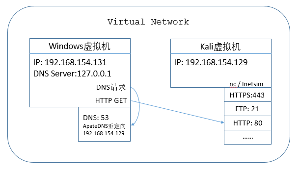

# 虚拟机环境配置

## 1. 网络环境搭建

   - Kali虚拟机，默认已安装inetsim，设置为host-only联网，IP为`192.168.154.129(可自己选择)`
   - winxp/win7虚拟机，用作恶意软件分析。设置为host-only联网，IP为`192.168.154.131(可自己选择)`。使用`apateDNS`软件将DNS服务器设置为`127.0.0.1`，并重定向到`192.168.154.129`
   - Kali虚拟机执行`sudo inetsim`或`nc -l -p [port number]`对请求进行监听
   - 在windows虚拟机上使用Wireshark进行网络封包分析

   

## 2. 禁止USB或蓝牙的自动连接

   `Virtual Machine Setting -> USB Controller -> [Uncheck] Automatically connect new USB devices -> [Uncheck]Share Bluetooth devices with the virtual machine`

## 3. 常用软件列表

   - strings: 字符串查看
   - Dependency Walker: 查看软件的导入导出函数
   - Winhex: 十六进制编辑器，其他可选：everedit
   - PEiD: 查看文件是否加壳
   - PEview: 查看PE文件，其他可选：pe explorer
   - regshot: 注册表快照
   - Resource hacker: 查看并保存软件的rsrc段
   - upx: 压缩和解压缩软件
   - apateDNS: DNS请求重定向
   - procexp, procmon: 进程查看及监控
   - IDA Pro: 反编译软件，静态分析
     - idapython：插件，为ida提供python脚本支持
   - Olldbg: 调试器，动态分析。其他可选：Immunity Debugger
     - HideDebugger: 插件，anti-debugger处理
   - windbg: 调试器，可用于内核调试
   - Wireshark: 网络封包分析

## 4. 虚拟机快照

   在安装好必备软件，配置好环境之后，要建立一个基础快照。

   - 分析完一个恶意软件后，将虚拟机恢复到基础状态，等待进行下一次分析。
   - 在分析软件1时，想要分析软件2，可以建立一个快照，然后恢复到基础状态，进行软件2的分析。

