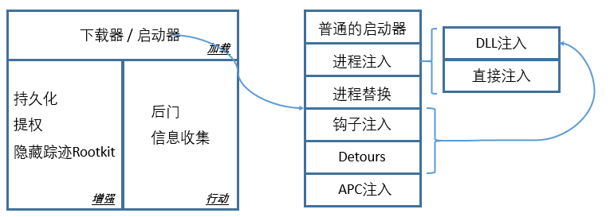

# 不同的恶意软件和它们的载入方式



*注：此处并没有包含恶意软件的所有功能*

## 一、载入方式

### 1. 普通的启动器

通常会进行权限提升，其自身携带了被载入的恶意代码，通常保存在资源段，所以会有资源处理相关函数。恶意代码加载到启动器的内存空间中，被执行。

### 2. 进程注入

#### 2.1 DLL注入

强制目标进程加载恶意DLL文件

```c
// 查找被注入进程
CreateToolhelp32Snapshot, Process32First, Process32Next
// 打开进程
hVictimProcess = OpenProcess(PROCESS_ALL_ACCESS, 0, victimProcessID);
// 为恶意DLL文件名分配空间
pNameInVictimProcess = VirtualAllocEx(hVictimProcess,...,sizeof(maliciousLibraryName),...,...);
// 设置恶意DLL文件名
WriteProcessMemory(hVictimProcess,...,maliciousLibraryName, sizeof(maliciousLibraryName),...);
// 找到LoadLibrary API的地址
GetModuleHandle("Kernel32.dll");
GetProcAddress(...,"LoadLibraryA");
// 创建线程载入恶意DLL
CreateRemoteThread(hVictimProcess,...,...,LoadLibraryAddress,pNameInVictimProcess,...,...);
```

**关键：**

- 被注入进程名：在第一步*查找被注入进程名*的过程中，`strncmp`可能会被调用，包含进程名
- 恶意DLL文件名：在*设置恶意DLL文件名*阶段，包含文件名

#### 2.2 直接注入

和DLL注入类似，只不过会把恶意代码也注入到目标进程中，不再单独写在DLL文件内，一般注入的是shellcode。

`VirtualAllocEx`和` WriteProcessMemory`会被调用两次，第一次为恶意代码需要的数据分配空间；第二次为恶意代码分配空间，最后调用`CreateRemoteThread`，`lpStartAddress`指向为恶意代码分配的空间，`lpParameter`指向为恶意代码需要的数据分配空间

**关键**：在调用`WriteProcessMemory`之前，查看内存数据，里面包含了恶意代码(shellcode)，进行分析。

### 3. 进程替换

```c
// 以睡眠的状态创建被替换进程
CreateProcess(...,"svchost.exe",...,CREATE_SUSPEND,...);
// 释放该进程的内存
ZwUnmapViewOfSection(...);
// 为恶意代码分配空间
VirtualAllocEx(...,ImageBase,SizeOfImage,...);
//# 写入恶意代码的头部
WriteProcessMemory(...,headers,...);
// 写入恶意代码的各个section
for (i=0; i < NumberOfSections; i++) {
	WriteProcessMemory(...,section,...);
}
// 设置被替换进程的entry point为新分配空间
SetThreadContext();
...
// 恢复线程启动
ResumeThread();
```

替换成`svchost.exe`是一个很流行的手法

### 4. 钩子注入

1. `LoadLibraryA`：要被载入的恶意DLL，其导出函数中包含了钩子函数
2. `GetProcAddress`：从恶意DLL中获取钩子函数的地址
3. 搜索并获取被注入线程ID
4. `SetWindowsHookExA`：`idHook`->一个不常见的消息类型，例如`WH_CBT`；`lpfn`->钩子函数，只执行` CallNextHookEx`；`hmod`->要被载入的恶意DLL；`dwThreadId`->要被注入的线程
5. 向被注入线程发送`WH_CBT`消息，DLL文件被载入，执行其中包含了恶意代码的`DllMain`，该函数应立即调用`LoadLibrary`和`UnhookWindowsHookEx`，确保不影响之后的正常消息。

### 5.  Detours

Detours是微软开发的一个库文件，可以用来修改PE文件。修改后的文件中增加了一个`.detour`段，该段有一个新的导入表，包含了恶意的DLL，Detours可以修改PE头指向这个新的导入表。这样该程序启动后，就会自动加载恶意DLL。

### 6. APC注入

APC(asynchronous procedure call)让线程可以在执行其正常流程前执行其他代码，如果让线程执行`LoadLibraryA`，就能进行DLL注入

- 在用户态进行

搜索目标线程：`CreateToolhelp32Snapshot, Process32First, Process32Next, Thread32First, Thread32Next`

获取线程句柄：`OpenThread`

插入APC：`QueueUserAPC([LoadLibraryA地址], [线程ID], [DLL名])`

- 在内核态进行

驱动或者rootkit想要在用户态执行代码，可以使用这种方式。

调用`KeInitializeAPC`初始化一个内核KAPC结构体，该函数第二个参数为要注入的线程

调用`KeInsertQueueApc`插入APC


