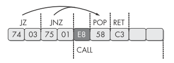
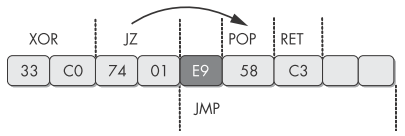
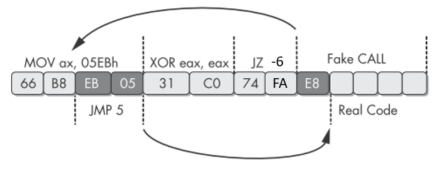

# 反汇编技术

## 一、原理

利用反汇编器的选择和假设，对其进行迷惑。

- Linear Disassembly：只能顺序进行反汇编，无法区分数据和代码
- Flow-Oriented Disassembly：在遇到有条件跳转指令时，会默认先反汇编false路径的代码，遇到`call`指令时，也会先反汇编`call`后面的代码。

大多数反汇编器使用的都是第二种策略，所以要实现**一个反汇编器无法识别的流程跳转**

## 二、简单识别

1. 使用IDA时要显示操作码

   `Options`->`General`->`Display disassembly line parts`->`Line prefixes`+`Number of opcode bytes(8)`

2. IDA中的cross-references显示为红色，说明引用的位置在当前指令的中间，而不是起始点

## 三、相关技术

### 1.  永远不会执行的跳转分支

将无条件跳转伪装成有条件跳转，这样其中的一个分支本来不会作为代码执行，但是IDA会把这部分内容作为代码分析。

**`jz`和`jnz`组合形成无条件跳转**  



 **让有条件跳转的条件永远为真**



不会作为代码执行的部分是**多字节操作码的第一个字节**作为数据，这时IDA会把该数据字节识别成多字节操作码的一部分。此时对于反汇编器来说，跳转目标处于多字节操作码的中间。

**解决方案**：将有问题的字节修改成NOP

### 2. 出现在多个指令中的字节



**解决方案**：分析出问题部分的代码功能，将无用的指令全部修改成NOP

### 3. 加大分析难度

1. 使用函数指针，加大代码复杂度，让IDA无法识别函数的cross-references

   **解决方案**：使用IDC函数`AddCodeXref([引用地址], [被引用地址], [引用类型]);`其中引用类型：`fl_CF(call)`、`fl_JF(jump)`

2. 在跳转指令后，将永远不会执行的部分写成一个**栈帧操作指令**，这时IDA会错误的对函数栈帧进行分析。

   可以利用*技术1*中的方法，或者直接使用`jmp`指令。

```assembly
00401543     sub_401543      proc near           ; CODE XREF: sub_4012D0+3Cp
00401543                                         ; sub_401328+9Bp
00401543
00401543     arg_F4          = dword ptr  0F8h
00401543     arg_F8          = dword ptr  0FCh
00401543
00401543 000                 sub     esp, 8
00401546 008                 sub     esp, 4
00401549 00C                 cmp     esp, 1000h
0040154F 00C                 jl      short loc_401556
00401551 00C                 add     esp, 4
00401554 008                 jmp     short loc_40155C
00401556     ; --------------------------------------------------------------
00401556
00401556     loc_401556:                        ; CODE XREF: sub_401543+Cj
00401556 00C                 add     esp, 104h	; 这里不会被执行，但是IDA对其进行了分析
0040155C
0040155C     loc_40155C:                        ; CODE XREF: sub_401543+11j
0040155C -F8                 mov     [esp-0F8h+arg_F8], 1E61h
00401564 -F8                 lea     eax, [esp-0F8h+arg_F8]
00401568 -F8                 mov     [esp-0F8h+arg_F4], eax
```

**解决方案**：按键`alt+k`可以快速对栈指针进行调整

### 4. 隐蔽的跳转

1. 使用`retn`进行跳转操作。`retn`实际上执行的是`pop`+`jmp`，所以只要在之前修改了栈顶元素，再执行`retn`，就会进行跳转，而且IDA无法将之后的内容识别成正常函数。

```assembly
004011C0 sub_4011C0      proc near               ; CODE XREF: _main+19p
004011C0                                         ; sub_401040+8Bp
004011C0
004011C0 var_4           = byte ptr -4
004011C0
004011C0                 call    $+5				; 栈顶：004011C5
004011C5                 add     [esp+4+var_4], 5	; 栈顶：004011CA
004011C9                 retn						; EIP：004011CA
004011C9 sub_4011C0      endp ; sp-analysis failed
004011CA ; ------------------------------------------------------------
004011CA                 push    ebp
004011CB                 mov     ebp, esp
004011CD                 mov     eax, [ebp+8]
004011D0                 imul    eax, 2Ah
004011D3                 mov     esp, ebp
004011D5                 pop     ebp
004011D6                 retn
```

**解决方案**：在IDA没有正确识别的位置按键`c`，让IDA将其识别为代码。

2. 利用SEH，自己在SEH handler中添加一项，然后引发异常，隐蔽地进行跳转，而此时IDA认为异常后面的代码仍能正常执行。

```assembly
;手动添加exception handler
push ExceptionHandler	; handler
push fs:[0]				; prev
mov fs:[0], esp
;引发异常
xor ecx, ecx
div ecx
;恢复现场
mov esp, [esp+8]
mov eax, fs:[0]
mov eax, [eax]
mov eax, [eax]
mov fs:[0], eax
add esp, 8
```

**解决方案**：在IDA没有正确识别的位置按键`c`，让IDA将其识别为代码。