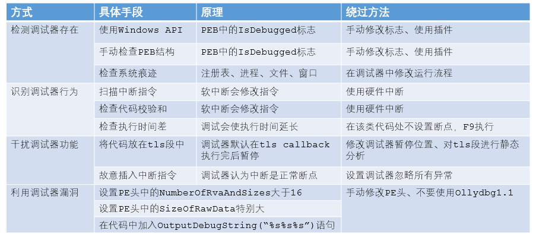

# 反调试技术



## Q&A

**1. 具体有哪些Windows API？**

   `IsDebuggerPresent`、`CheckRemoteDebuggerPresent`、`NtQueryInformationProcess([进程句柄]，  ProcessDebugPort(0x7))`、`OutputDebugString`

   最后一个API的原理不是检查PEB中的标志：

```c++
DWORD errorValue = 12345;
SetLastError(errorValue);
OutputDebugString("Test for Debugger");
if(GetLastError() == errorValue) {
  ExitProcess();
}
else {
  RunMaliciousPayload();
}
```

**注意：最后这个方法在win7上实验已经不行了，在XP系统上可以。**

**2. PEB中的哪些位置可以用来判断调试器的存在？**

   `fs:[30h]`保存了进程的PEB结构地址

   - **第三个字节**为`BeingDebugged`标志。

   - `0x18`是`ProcessHeap`，指向进程的堆结构，包含了一个头部。头部偏移`0x10(xp)`、`0x44(7 32bits)`为`ForceFlags`标志，偏移`0x0c(xp)`、`0x40(7)`为`Flags`标志。

     **如果使用的是Windbg，可以使用`windbg –hd [进程名]`的方式，以正常的方式启动堆，绕过该检查**

   - 偏移`0x68`表示进程如何创建堆结构，若为`0x70`，则表示在使用调试器。

**3. 怎样检查执行时间？**

   - `rdtsc(0x0F31)`计算机器自重启以来经过的时间
   - `QueryPerformanceCounter`、`GetTickCount`

**4. tls callback的执行有什么需要注意的吗？**

该函数中的代码开头一般会对参数的数值进行一个检查，`cmp [ebp+arg_4], 2`，这是为了判断在何时执行该函数，`1`表示进程开始时，`2`表示线程开始时，`3`表示进程结束时。

**5. 恶意软件会插入什么样的中断指令？**

   - 插入`0xCD03(INT 3)`，WinDbg会捕捉这个异常，在后台为EIP增加一字节，导致执行完全不同的代码。

   - 插入`INT 3(OxCC)`:

     ```assembly
     push offset continue
     push dword fs:[0] 
     mov fs:[0], esp 		; 修改了SEH异常处理函数
     int 3					; 故意产生异常
     //being debugged
     continue: 				; 如果在调试，调试器会认为遇到断点，继续执行
     //not being debugged 	; 如果不在调试，程序会跳转到异常处理函数
     ```

   - 插入`icedp(0xF1)`，会生成单步调试异常，如果这时debugger在单步调试，会认为这是一个正常指令，不会执行异常处理函数。

**6. PE头中的那两个值具体在哪里？**

- `IMAGE_OPTIONAL_HEADER`->`0x5c DWORD NumberOfRvaAndSizes`
- `IMAGE_SECTION_HEADER`->`0x10 DWORD SizeOfRawData`

**7. 怎样修改运行时进程的PEB头标志？**

- `Plugins->Command Line`->`dump fs:[30]+2`->在dump窗口中，右键`BeingDebugged`标志，选择`Binary->Fill With 00's`。修改其他标志也类似。

  ```assembly
  dump ds:[fs:[30] + 0x18] + 0x10         ; ForceFlags
  dump fs:[30] + 0x68                     ; NTGlobalFlag
  ```

- 使用插件 PhantOm 中的`hide from PEB`选项

**8. 都有哪些插件可以对抗反调试技术？**

- Hide Debugger
- PhantOm