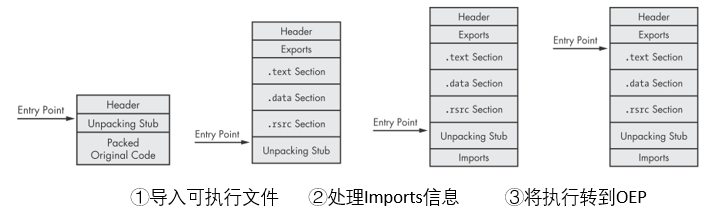

# 加壳程序处理

## 一. 怎样识别加壳程序

1. PEiD软件识别
2. strings软件查看字符串的输出很少
3. 导入函数很少
4. PE文件头中，节大小`Virtual Size`比`Size of Raw Data`大很多
5. 程序的节名中存在可识别的加壳器名字
6. 使用IDA进行分析时，识别出来的代码很少
7. 使用Ollydbg调试程序时，会弹出加壳警告
8. 使用专门的工具计算熵值，例如` Mandiant Red Curtain`

## 二、脱壳流程

①Loader/Stub根据Header为section分配空间，Stub将各section脱壳并放入对应空间

② 不同的处理导入信息的方式

- Stub负责加载`LoadLibrary`和`GetProcAddress`函数，在①后，再根据原始的Imort信息，利用这两个函数将DLL文件导入，获得相应函数地址。
- 保持原始的Import table不变，由Windows loader负责处理导入。
- 只保留原始Import table中每个DLL文件中的一个函数，由loder负责导入DLL文件，stub负责恢复函数地址。
- 不保留任何Import内容，由stub自己从其他库中找到需要的函数，或者stub先找到上述两个函数，再用其定位其他函数。

③trail jump：使用`jmp`、`call`、`ret`、`NtContinue`、`ZwContinue`将执行转到OEP。

## 三、手动脱壳

*注1：极少数情况可以找到软件对程序进行自动脱壳。*

*注2：对于DLL文件，只需要把`IMAGE_FILE_HEADER`中的`IMAGE_FILE_DLL(0x2000)`标志去除，就可以按照正常的EXE文件进行脱壳了。*

**静态脱壳：**分析packer的算法，写一个逆向的程序进行脱壳。

**动态脱壳：**运行程序，让stub完成可执行文件的加载，然后将内存中的进程保存到文件，重建Import table，修改PE header

1. 利用Ollydbg中的插件OllyDump

   ①`Plugins->OllyDump->Find OEP by Section Hop`会自动找到OEP的位置，设置断点

   ②`Plugins->OllyDump->Dump Debugged Process`会自动完成Import table的重建以及PE header的修改

   若OllyDump在上述步骤均失败，只将内存中的进程保存到文件，就需要自己完成接下来的步骤：

2. 重建Import table

   - 使用工具`ImpRec`: 选择可执行文件->输入OEP的RVA(相对虚拟地址)->`IAT autosearch`->`GetImports`->`Fix Dump`->选择OllyDump保存的文件

   - 将dump下来的文件在IDA中打开，每遇到一个调用地址超过程序范围的`call`指令就记录下来，然后在ollydbg中定位该地址，查看其功能并标记到ida中。

     **怎样在Ollydbg中确定函数名称：**将随意一个寄存器的值修改为目标函数的地址，查看Ollydbg对其的解析。

   - 根据PE文件的格式，找到import函数的位置，逐个查看并创建import table。

3. **关键步骤**：寻找OEP

   *注：设置断点时要注意，尽量不要使用软断点。加壳程序会自己修改代码，导致软断点不起作用。*

   **直接定位：**

   - IDA：寻找以下特征的`jmp`指令

     位于代码最后（后面接了很多DB），会跳转到一个很远的地址（在graph视图下，该指令因为找不到目标而标红）。可以在ollydbg验证该目标地址的内容是否会在可执行文件载入后发生改变

   - 在栈上设置读断点

     确定stub第一次push时的栈地址，在该处设置一个hardware breakpoint on read。应尝试多种类型的断点。

   - 在已知原始程序一定会调用的函数上设置断点，向上回溯

     命令行程序：`GetVersion`、`GetCommandLineA`

     GUI程序：`GetModuleHandleA`

   - 使用ollydbg的`Run Trace`选项，在`.text`第一次有指令执行的时候中断。

   **加快寻找速度**

   - 在调用`GetProcAddress`的地方设置断点，这样可以跳过大部分stub的代码
   - 在每次循环结束的地方设置断点，可以跳过很多重复的部分

   **验证**

   - 跳转到OEP的偏移量会偏大，通常stub并不大
   - OEP附近的代码看起来比stub的代码更加正常

## 四、常见加壳软件的处理方法

*注：实验过程中发现不太准确，随缘吧~*

| packer         | OEP                                                          | Import table               | anti-debugging              |
| -------------- | ------------------------------------------------------------ | -------------------------- | --------------------------- |
| UPX            | OllyDump, Stub终点的tail jump                                | OllyDump                   | -                           |
| PECompact      | 终点的tail jump `jmp eax`                                    | -                          | 调试时要绕过异常            |
| ASPack         | 自动化工具，在栈上设置硬件读断点`PUSHAD`                     | 自动化工具                 | -                           |
| Petite         | 在栈上设置硬件读断点                                         | 为每个库保留了一个导入函数 | 将single-step异常传递给程序 |
| WinUpack/UPack | 自动化工具; 在`GetProcAddress`上设置断点，在之后的每个jmp和call上设置断点，找到`ret`； 在`GetModuleHandleA`或`GetCommandLineA`上设置断点 | 自动化工具                 | 利用了ollydbg的漏洞         |
| Themida        | 自动化工具；使用`ProcDump`直接将正在运行的进程dump下来进行一些基本的分析 | 自动化工具                 | 阻止调试、虚拟机、procmon   |

### 