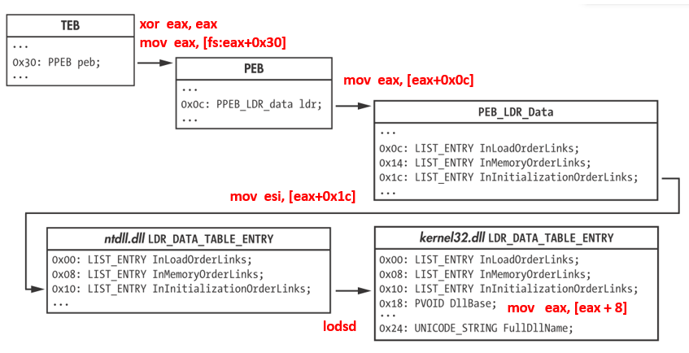
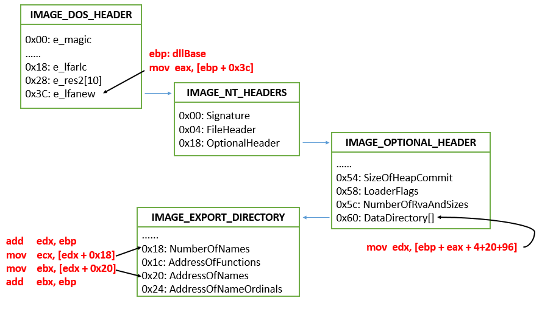
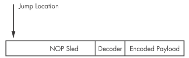

# shellcode分析

## 一、shellcode技术特点

### 1. 地址计算需要先获取基地址

shellcode是position independent code，所有的地址计算应该都是**基地址+偏移**的方式，`jump`和`call`这类跳转指令本身使用的就是这种方式，但是`mov`这类指令必须首先把eip中的地址传入通用寄存器中，作为基地址。

#### 获得基地址的方式

- `call`+`pop`

  `call`指令实际做的是`push eip` + `jump 【address】`的操作，在`【address】`开始的地方执行`pop 【寄存器】`就可以把eip的内容保存到【寄存器】中。

```assembly
	sub     esp, 20h
	xor     edx, edx
	call    sub_17 
	db 'Hello World!',0 

sub_17: 
	pop     edi               ; edi gets string pointer
	push    edx               ; uType: MB_OK 
	push    edi               ; lpCaption
	push    edi               ; lpText
	push    edx               ; hWnd: NULL
	mov     eax, 7E4507EAh    ; MessageBoxA
	call    eax 
```

- `fnstenv`

  系统执行浮点运算时，会更新FPU的执行环境，`fnstenv`指令会将该环境以[`FpuSaveState`的结构](./07_常用结构体.md)保存到内存中。

  该结构体的`0x0c`偏移处`fpu_instruction_pointer`就是上一次执行浮点运算的指令地址。可以以此为基地址进行地址计算。
  
  ```assembly
  Bytes            Disassembly
  83 EC 20         sub     esp, 20h
  31 D2            xor     edx, edx
  EB 15            jmp     short loc_1C
  EA 07 45 7E      dd 7E4507EAh               ; MessageBoxA
  FA CA 81 7C      dd 7C81CAFAh               ; ExitProcess
  48 65 6C 6C 6F   db 'Hello World!',0
  20 57 6F 72 6C 
  64 21 00            
  loc_1C:
  D9 EE            fldz 						; 执行浮点运算
  D9 74 24 F4      fnstenv byte ptr [esp-0Ch] ; 将结构体保存到[esp-0Ch]，注意这个偏移
  											; 此时esp正好指向fpu_instruction_pointer
  5B               pop     ebx          		; ebx就是fldz指令所在地址了 
  8D 7B F3         lea     edi, [ebx-0Dh]     ; 指向字符串HelloWorld
  52               push    edx                ; uType: MB_OK 
  57               push    edi                ; lpCaption
  57               push    edi                ; lpText
  52               push    edx                ; hWnd: NULL
  8B 43 EB         mov     eax, [ebx-15h]     ; 函数MessageBoxA的地址
  FF D0            call    eax                ; call MessageBoxA
  52               push    edx                ; uExitCode
  8B 43 EF         mov     eax, [ebx-11h]     ; 函数ExitProcess的地址
  FF D0            call    eax                ; call ExitProcess
  ```

### 2. 需要自己处理导入函数

shellcode需要自己处理导入的库文件及函数，通常会使用`kernel32.dll`中的`LoadLibraryA`和`GetProcAddress`函数获得其他需要函数的地址。

#### 函数地址解析流程

1）确定`kernel32.dll`的位置



**注意：**win7之前，第二个初始化的DLL是kernel32.dll，从win7开始就不是了，所以需要对`InInitializationOrderLinks`进行遍历，查看`LDR_DATA_TABLE_ENTRY`中偏移`0x24`处的`FullDllName`是不是`kernel32.dll`。

2）定位具体函数(LoadLibraryA)位置

获得了`kernel32.dll`文件位置后，按照PE文件格式定位到`IMAGE_OPTIONAL_HEADER`中的` DataDirectory`数组，其第一个元素就指向了`IMAGE_EXPORT_DIRECTORY`结构。

**注意：所有在PE头中获得的地址都是RVA，需要加上上一步中获得的`dllBase`才能得到VA。**



```assembly
findSymbolByHash:
    pushad
    ; 定位IMAGE_EXPORT_DIRECTORY
    mov     ebp, [esp + 0x24]       	; dllBase
    mov     eax, [ebp + 0x3c]       	; rva of PE signature
    mov     edx, [ebp + eax + 4+20+96] 	; rva of DataDirectory
    add     edx, ebp                	; va of DataDirectory/IMAGE_EXPORT_DIRECTORY
    ; 循环遍历：确定目标函数在AddressOfNames中的索引值
    mov     ecx, [edx + 0x18]       	; ecx:= NumberOfNames
    mov     ebx, [edx + 0x20]       	; ebx:= RVA of AddressOfNames
    add     ebx, ebp                	; ebx:= VA of AddressOfNames
.search_loop:							
    jecxz   .error_done             	
    dec     ecx                    	 	
    mov     esi, [ebx+ecx*4]        	
    add     esi, ebp                	; esi:= 要检查的函数名称
    push    esi       
    call    hashString      			; 计算函数名的哈希值
    cmp     eax, [esp + 0x28]  			; 是否和想要的函数名相同
    jnz     .search_loop
    ; 根据索引值在AddressOfNameOrdinals确定目标函数的ordinal，作为AddressOfFunctions的索引值
    mov     ebx, [edx+0x24]         	; ebx:= RVA OF AddressOfNameOrdinals
    add     ebx, ebp                	; ebx:= VA OF AddressOfNameOrdinals
    mov     cx, [ebx+ecx*2]  			; ecx:= 目标函数的ordinal
    ; 确定目标函数的地址
    mov     ebx, [edx+0x1c]         	; ebx:= RVA of AddressOfFunctions
    add     ebx, ebp                	; ebx:= VA of AddressOfFunctions
    mov     eax, [ebx+ecx*4]          	; eax:= rva of 目标函数
    add     eax, ebp                	; eax:= va of 目标函数
    jmp     near .done
.error_done:
    xor     eax, eax               
.done:
    mov     [esp + 0x1c], eax       
    popad
    retn    8
```

使用上述步骤确定`LoadLibraryA`函数的地址，就可以导入其他DLL文件。

再次利用上述步骤从其他DLL文件中获得任意函数地址，不再需要`GetProcAddress`函数，这样做，代码中的函数名使用的都是哈希值，加大了分析难度。

**注意：**在循环遍历中比较函数名时，为避免函数名占用过多字节，使shellcode的长度超过限制，会对函数名进行hash。常用方法：`32-bit rotate-right-additive hash`

### 3. 对shellcode进行编码

存在漏洞的程序对了shellcode可能会有额外的要求：

- 中间不包含NULL字符
- 所有字符可打印
- 只包含字母或者数字
- ……

为了应对这些要求，shellcode可能采取的编码方法有：

- XOR
- 把每个字节分成两份4 bits，将其加到一个固定的可打印字符上，即一个字节变成了两个可打印的字符。

### 4. NOP Sleds



1. NOP Sleds的目的是为了让执行流程转移到shellcode的概率更大
2. 填充的不一定是nop指令，也可以是其他的单字节指令
   - `0x40`-`0x4f`通用寄存器的自增或自检指令
   - 可打印字符，可以通过过滤器

## 二、如何确定shellcode的位置

1. 在使用javascript的位置，例如网页、PDF，最常见的就是`%uXXYY`、`%XX`或者两者组合在一起的格式。可以使用`unescape`进行解码

2. 在可执行文件中寻找shellcode位置时，可以寻找进程注入相关函数：`VirtualAllocEx`，`WriteProcessMemory`， `CreateRemoteThread`.

3. 多媒体文件中的shellcode可能是未编码的。

4. IDA中可以导入任意的二进制文件，但是无法识别具体指令。可以搜索decoder中大概率会使用的指令

   | Instruction type        | Common opcodes    |
   | ----------------------- | ----------------- |
   | Call                    | 0xe8              |
   | Unconditional jumps     | 0xeb, 0xe9        |
   | Loops                   | 0xe0, 0xe1, 0xe2  |
   | Short conditional jumps | 0x70 through 0x7f |

5. 如果是一些特定的文件格式，需要对该格式有所了解，知道它能够包含什么样的数据。

## 三、shellcode的动态分析

1. 将Ollydbg设置为just-in-time debugger：` Options->Just-in-time Debugging->Make OllyDbg Just-in-time Debugger`

2. 使用实验自带的`shellcode_launcher.exe`加载shellcode

   `-i` 指定shellcode文件

   `-bp` 在shellcode未开始前添加断点

   `-L` 需要加载的DLL文件

   `-r` 在启动shellcode前先打开某文件

3. 如果shellcode本身在一个EXE文件内部，之后注入其他进程，可以在Ollydbg中打开EXE文件，然后直接将EIP设置到shellcode的起始位置。

4. 个人调试经验(不知道是否绕了弯路)

   如果shellcode进行了编码，在Ollydbg中执行完decode之后，在代码处右键，`backup->save data to file`，然后在ida中打开保存的mem文件，进行静态分析，找到`findKernel32Base`和`findSymbolByHash`这样功能的函数。回到ollydbg，这里一定要单步调试step-into，否则会报错。找到hash函数那里，定位到比较函数名，比较成功的那句指令，设置断点，F9，查看都导入了哪些函数。