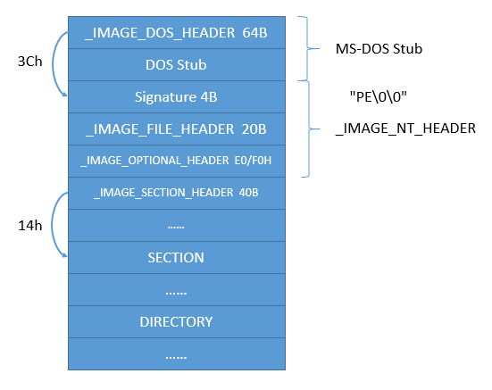
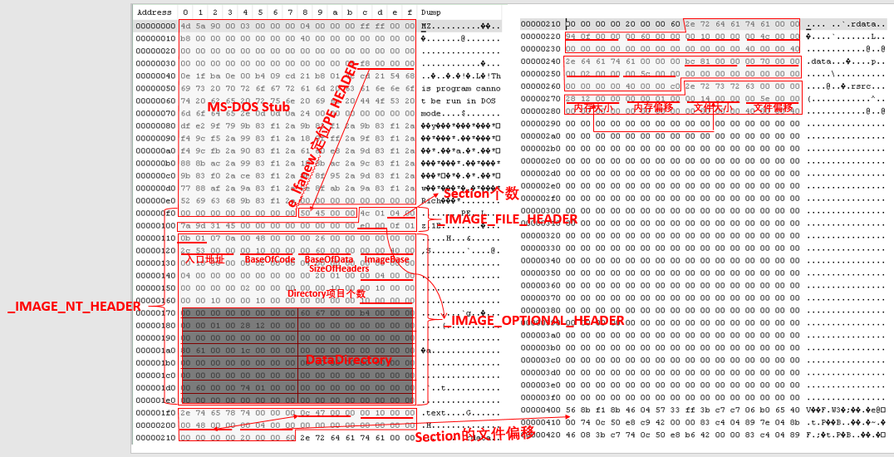

## PE文件格式总结

## 一、图解





## 二、结构体详细信息

### 1. IMAGE_DOS_HEADER

```c
struct _IMAGE_DOS_HEADER{
    0X00 WORD e_magic;     // Magic DOS signature MZ(4Dh 5Ah):MZ标记:用于标记是否是可执行文件
    0X02 WORD e_cblp;    
    0X04 WORD e_cp;      
    0X06 WORD e_crlc;    
    0X08 WORD e_cparhdr;  
    0X0A WORD e_minalloc; 
    0X0C WORD e_maxalloc; 
    0X0E WORD e_ss;      
    0X10 WORD e_sp;      
    0X12 WORD e_csum;     
    0X14 WORD e_ip;      
    0X16 WORD e_cs;     
    0X18 WORD e_lfarlc;   
    0X1A WORD e_ovno;    
    0x1C WORD e_res[4]; 
    0x24 WORD e_oemid;   
    0x26 WORD e_oeminfo;  
    0x28 WORD e_res2[10]; 
    0x3C DWORD e_lfanew;   // Offset to start of PE header:定位PE文件，PE头相对于文件的偏移量
};
```

### 2. IMAGE_NT_HEADERS

```c
typedef struct _IMAGE_NT_HEADERS {
    DWORD Signature;        // PE Signature: 50450000 ("PE"00)
    IMAGE_FILE_HEADER FileHeader;
    IMAGE_OPTIONAL_HEADER32 OptionalHeader;
} IMAGE_NT_HEADER32, *PIMAGE_NT_HEADER32;
```

### 3. IMAGE_FILE_HEADER

```c
struct _IMAGE_FILE_HEADER{
    0x00 WORD Machine;                  // 程序执行的CPU平台:0X0:任何平台，0X14C:intel i386及后续处理器
    0x02 WORD NumberOfSections;         // PE文件中区块数量
    0x04 DWORD TimeDateStamp;           // 时间戳：连接器产生此文件的时间距1969/12/31-16:00P:00的总秒数
    0x08 DWORD PointerToSymbolTable;  
    0x0c DWORD NumberOfSymbols;       
    0x10 WORD SizeOfOptionalHeader;   // IMAGE_OPTIONAL_HEADER结构的大小(字节数):32位默认E0H,64位默认F0H(可修改)
    0x12 WORD Characteristics;          // 如果 & 0x2000 后不为零，说明是DLL文件
};
```

### 4. IMAGE_OPTIONAL_HEADER

```c
struct _IMAGE_OPTIONAL_HEADER{
    0x00 WORD Magic;                    // 幻数(魔数)，0x0107:ROM image,0x010B:32位PE，0X020B:64位PE 
    0x02 BYTE MajorLinkerVersion;     
    0x03 BYTE MinorLinkerVersion;    
    0x04 DWORD SizeOfCode;              
    0x08 DWORD SizeOfInitializedData;   
    0x0c DWORD SizeOfUninitializedData; 
    0x10 DWORD AddressOfEntryPoint;     // 程序入口地址OEP
    0x14 DWORD BaseOfCode;              // 代码段起始地址(代码基址),(代码的开始和程序无必然联系)
    0x18 DWORD BaseOfData;              // 数据段起始地址(数据基址)
    0x1c DWORD ImageBase;               // 内存镜像基址(默认装入起始地址),默认为4000H
    0x20 DWORD SectionAlignment;        // 内存对齐:一旦映像到内存中，每一个section保证从一个「此值之倍数」的虚拟地址开始
    0x24 DWORD FileAlignment;         
    0x28 WORD MajorOperatingSystemVersion;   
    0x2a WORD MinorOperatingSystemVersion;    
    0x2c WORD MajorImageVersion;              
    0x2e WORD MinorImageVersion;              
    0x30 WORD MajorSubsystemVersion;          
    0x32 WORD MinorSubsystemVersion;          
    0x34 DWORD Win32VersionValue;            
    0x38 DWORD SizeOfImage;         // PE文件在内存中映像总大小
    0x3c DWORD SizeOfHeaders;       //※DOS头(64B)+PE标记(4B)+标准PE头(20B)+可选PE头+节表的总大小，按照文件对齐(FileAlignment的倍数)
    0x40 DWORD CheckSum;           
    0x44 WORD Subsystem;        // GUI: 2; CUI: 3
    0x46 WORD DllCharacteristics;  
    0x48 DWORD SizeOfStackReserve; 
    0x4c DWORD SizeOfStackCommit;  
    0x50 DWORD SizeOfHeapReserve;   
    0x54 DWORD SizeOfHeapCommit;   
    0x58 DWORD LoaderFlags;      
    0x5c DWORD NumberOfRvaAndSizes; //目录项数目：总为0X00000010H(16)
    0x60 _IMAGE_DATA_DIRECTORY DataDirectory[IMAGE_NUMBEROF_DIRECTORY_ENTRIES];
};
```

### 5. IMAGE_DATA_DIRECTORY

```c
typedef struct _IMAGE_DATA_DIRECTORY {
    0x00 DWORD   VirtualAddress;
    0x04 DWORD   Size;
} IMAGE_DATA_DIRECTORY, *PIMAGE_DATA_DIRECTORY;
```

### 6. IMAGE_EXPORT_DIRECTORY

```c
typedef struct _IMAGE_EXPORT_DIRECTORY {
    0x00 DWORD   Characteristics;    // 未使用，总为0 
    0x04 DWORD   TimeDateStamp;      // 文件创建时间戳
    0x08 WORD    MajorVersion;       // 未使用，总为0 
    0x0a WORD    MinorVersion;       // 未使用，总为0
    0x0c DWORD   Name;               // 指向一个代表此 DLL名字的 ASCII字符串的 RVA
    0x10 DWORD   Base;               // 函数的起始序号
    0x14 DWORD   NumberOfFunctions;  // 导出函数的总数
    0x18 DWORD   NumberOfNames;      // 以名称方式导出的函数的总数
    0x1c DWORD   AddressOfFunctions;     // 指向输出函数地址的RVA
    0x20 DWORD   AddressOfNames;         // 指向输出函数名字的RVA
    0x24 DWORD   AddressOfNameOrdinals;  // 指向输出函数序号的RVA
} IMAGE_EXPORT_DIRECTORY, *PIMAGE_EXPORT_DIRECTORY;
```

### 7. IMAGE_SECTION_HEADER

```c
typedef struct _IMAGE_SECTION_HEADER {
	0x00 BYTE  Name[IMAGE_SIZEOF_SHORT_NAME];
  	0x08 union {
    	DWORD PhysicalAddress;
    	DWORD VirtualSize;			// 进程加载时section占用空间大小
  	} Misc;
  	0x0c DWORD VirtualAddress;			
  	0x10 DWORD SizeOfRawData;		// section在硬盘上占据的大小，应接近VirtualSize
  	0x14 DWORD PointerToRawData;
  	0x18 DWORD PointerToRelocations;
  	0x1c DWORD PointerToLinenumbers;
  	0x20 WORD  NumberOfRelocations;
  	0x22 WORD  NumberOfLinenumbers;
  	0x24 DWORD Characteristics;
} IMAGE_SECTION_HEADER, *PIMAGE_SECTION_HEADER;
```

